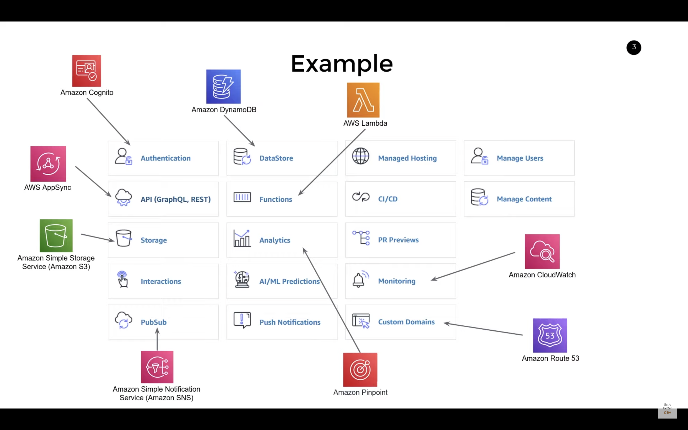

# Amplify
Framework that creates and manages a bunch of services in AWS, see also the alternative, [Serverless](https://www.serverless.com/).

By choosing Amplify as infrastructure and CI there are certain choises that are made and desisoins that are taken for you.

Notes:
* Some adjustments to make nextjs fit to Amplify
  * "next build && next export" identifies that it´s a SSG (static site generation) app.
  * Amplify needs a trailing slash at the end of signin URI 
* Need to use the "amplify" command from adding/removing components from your app and for CI commands.
* Mono/multi-repo - Choose the best match for local dev and CI env.
* Folder structure - Find a structure for best matching local dev and CI env

What took time:
* Trying to remove phantom Amplify app
* Change repo and path for multi-repo
* Force push on master made it break

Warnings:
* [https://docs.amplify.aws/guides/hosting/nextjs/q/platform/js/#prerequisites](https://docs.amplify.aws/guides/hosting/nextjs/q/platform/js/#prerequisites)
* Lots of deprecated and security warnings from build and setup

## Toolchain
Some AWS Amplify toolchain commands:

### amplify
Used to configure AWS resources.

Install and configure for use:
```
npm install -g @aws-amplify/cli

amplify configure
```

```
Status:
amplify status

User status:
amplify user status

Continue working on another machine:
amplify pull --appId <appid> --envName dev
```

## Amplify UI
* [https://ui.docs.amplify.aws/components/authenticator](https://ui.docs.amplify.aws/components/authenticator)

## Services


