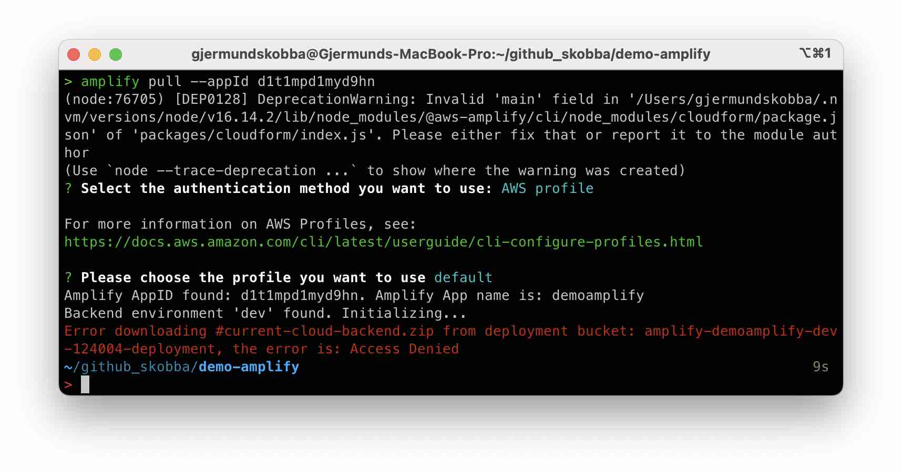
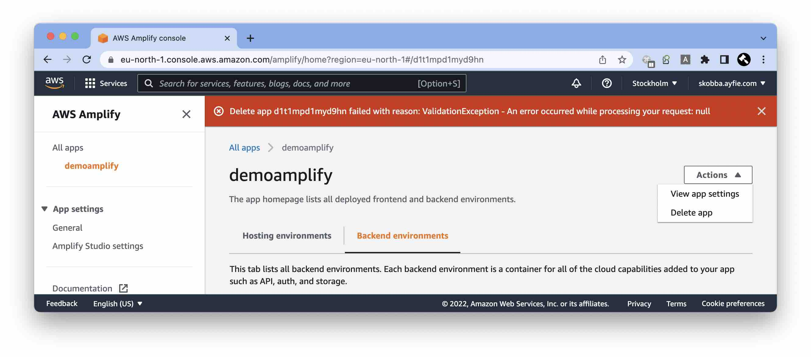
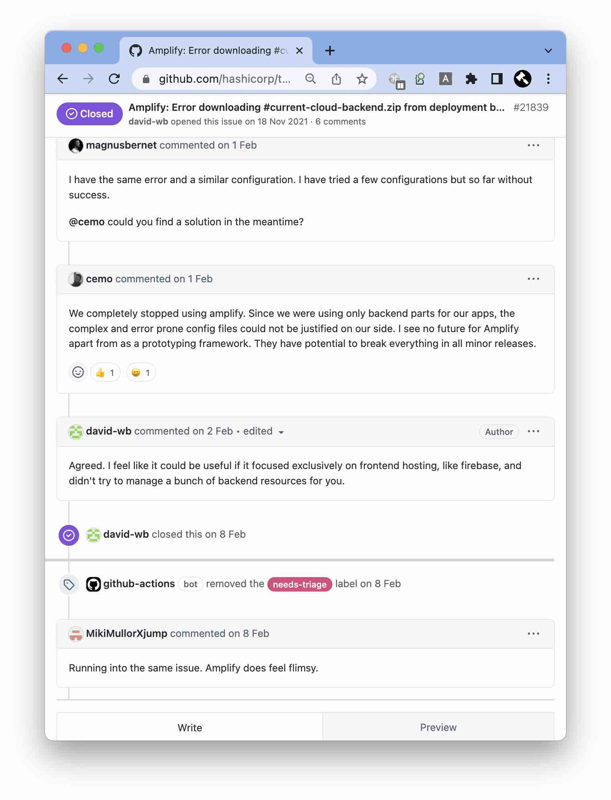

# Errors

## Not able to pull Amplify app


## Not able to delete Amplify app


## Github Issue


## Warnings
```
added 1714 packages, and audited 1740 packages in 52s

57 packages are looking for funding
  run `npm fund` for details

38 vulnerabilities (4 low, 1 moderate, 32 high, 1 critical)

To address issues that do not require attention, run:
  npm audit fix

To address all issues (including breaking changes), run:
  npm audit fix --force

Run `npm audit` for details
```

Warnings from CI build:


