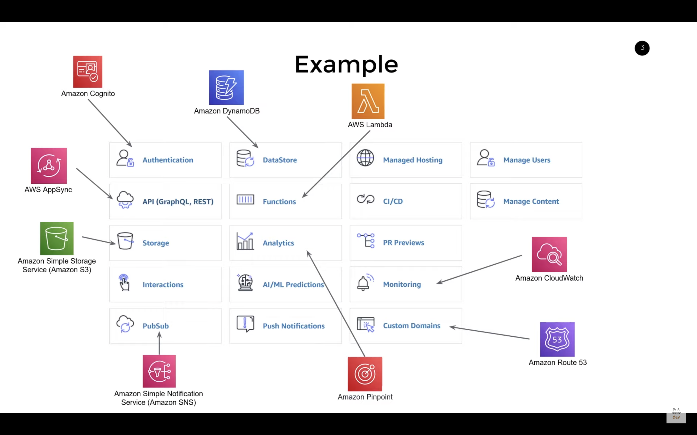
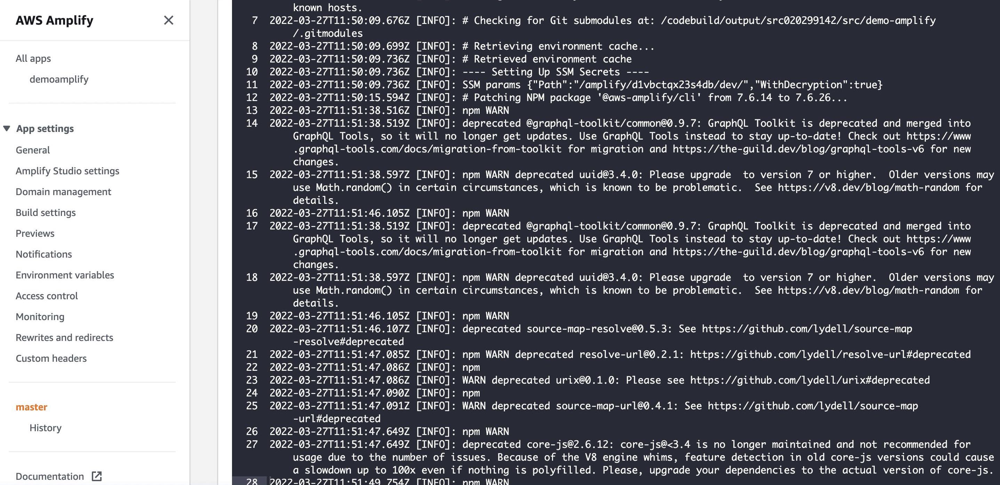

# Amplify
Framework that creates and manages a bunch of services in AWS, see also the alternative, [Serverless](https://www.serverless.com/).

## Toolchain
Some AWS Amplify toolchain commands:

### amplify
Used to configure AWS resources.

Install and configure for use:
```
npm install -g @aws-amplify/cli

amplify configure
```

```
Status:
amplify status

User status:
amplify user status

Continue working on another machine:
amplify pull --appId <appid> --envName dev
```

## Services


## Warnings
```
added 1714 packages, and audited 1740 packages in 52s

57 packages are looking for funding
  run `npm fund` for details

38 vulnerabilities (4 low, 1 moderate, 32 high, 1 critical)

To address issues that do not require attention, run:
  npm audit fix

To address all issues (including breaking changes), run:
  npm audit fix --force

Run `npm audit` for details
```

Warnings from CI build:


## Notes and findings
By choosing Amplify as infrastructure and CI there are certain choises that are made and desisoins that are taken for you.

Identify which ones.
* Some adjustments to make nextjs fit to Amplify like "next build && next export" identifies that it´s a SSG (static site generation) app.
* Need to use the "amplify" command from adding/removing components from your app and for CI commands.
* What to do if we need to create a new AIM user (in aws)?
* What to do for a new developer to enter the team.
* Mono/multi-repo - Choose the best match for local dev and CI env.
* Folder structure - Find a structure for best matching local dev and CI env, who does "amplify init" to be used in monorepos (can/should it be run muiltiple times?).

Findings
* [https://docs.amplify.aws/guides/hosting/nextjs/q/platform/js/#prerequisites](https://docs.amplify.aws/guides/hosting/nextjs/q/platform/js/#prerequisites)
* Lots of deprecated and security warnings from build and setup

