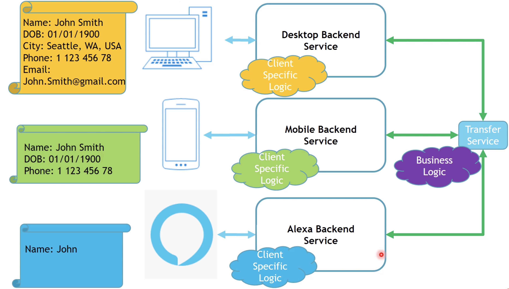

# Backend for Frontend

Considreations
* How many backends?
* [https://blog.bitsrc.io/bff-pattern-backend-for-frontend-an-introduction-e4fa965128bf](https://blog.bitsrc.io/bff-pattern-backend-for-frontend-an-introduction-e4fa965128bf)

BFF with a common Transfere Service

