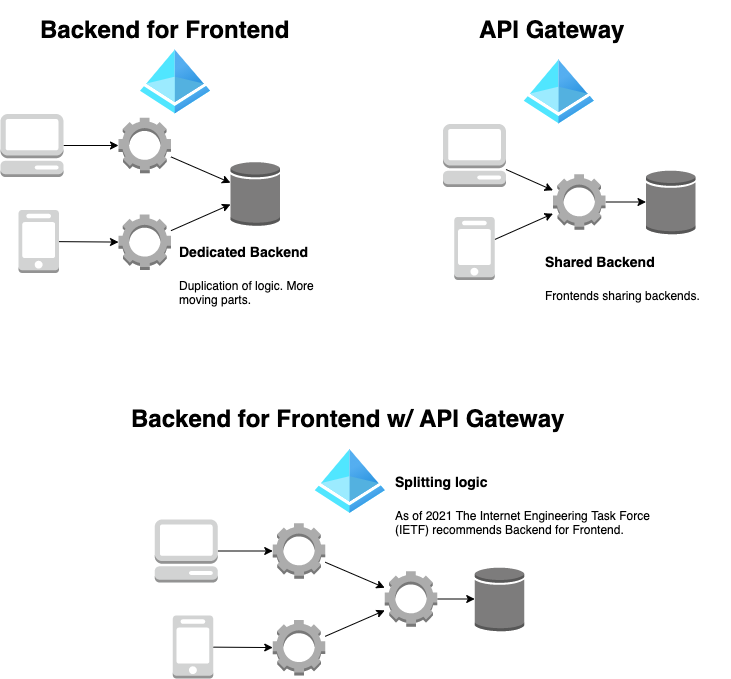
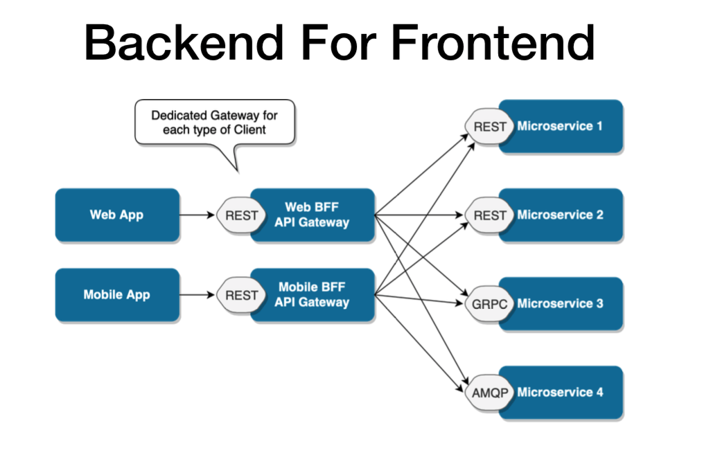

# Backend for Frontend

## Considreations
* How many backends?
* [https://blog.bitsrc.io/bff-pattern-backend-for-frontend-an-introduction-e4fa965128bf](https://blog.bitsrc.io/bff-pattern-backend-for-frontend-an-introduction-e4fa965128bf)

A BFF should not add new functionality!

## Advantages of BFF
___Separation of concerns___

  Frontend requirements will be separated from the backend concerns. This is easier for maintenance.

___Easier to maintain and modify APIs___

The client application will know less about your APIs’ structure, which will make it more resilient to changes in those APIs.

___Better error handling in the frontend___

Server errors are meaningless to the frontend user most of the time. Instead of directly returning the error server sends, the BFF can map out errors that need to be shown to the user. This will improve the user experience.

___Multiple device types can call the backend in parallel___

While the browser is making a request to the browser BFF, the mobile devices can do the same. It will help obtain responses from the services faster.

___Better security___

Certain sensitive information can be hidden, and unnecessary data to the frontend can be omitted when sending back a response to the frontend. The abstraction will make it harder for attackers to target the application.

___Shared team ownership of components___

Different parts of the application can be handled by different teams very easily. Frontend teams get to enjoy ownership of both their client application and its underlying resource consumption layer; leading to high development velocities.

## Best practices
* ___Avoid implementing a BFF with self-contained all-inclusive APIs___

Your self-contained APIs should be in the microservices layer. Most developers forget this and start implementing service-level APIs in the BFF as well. You should keep in mind that the BFF is a translation layer between the client and the services. When data is returned from a service API, the purpose of it is to transform it into the data type specified by the client application.

* ___Avoid BFF logic duplication___

A vital point to note is that a single BFF should cater to a specific user experience, not a device type. For example, most of the time, all mobile devices (iOS, Android, etc.) share the same user experience. In that case, one BFF for all these operating systems is sufficient. There is no need to have a separate BFF for iOS and another for Android.

* ___Avoid over-relying on BFFs___

A BFF is merely a translation layer. Yes, it provides a certain level of security to the application too. But, you should not rely on it more than you should. Your API layer and frontend layer should take care of all the functionality and security aspects regardless of the presence of a BFF or not. Because the BFF is supposed to fill a gap, not add any functionality or service to the application.

