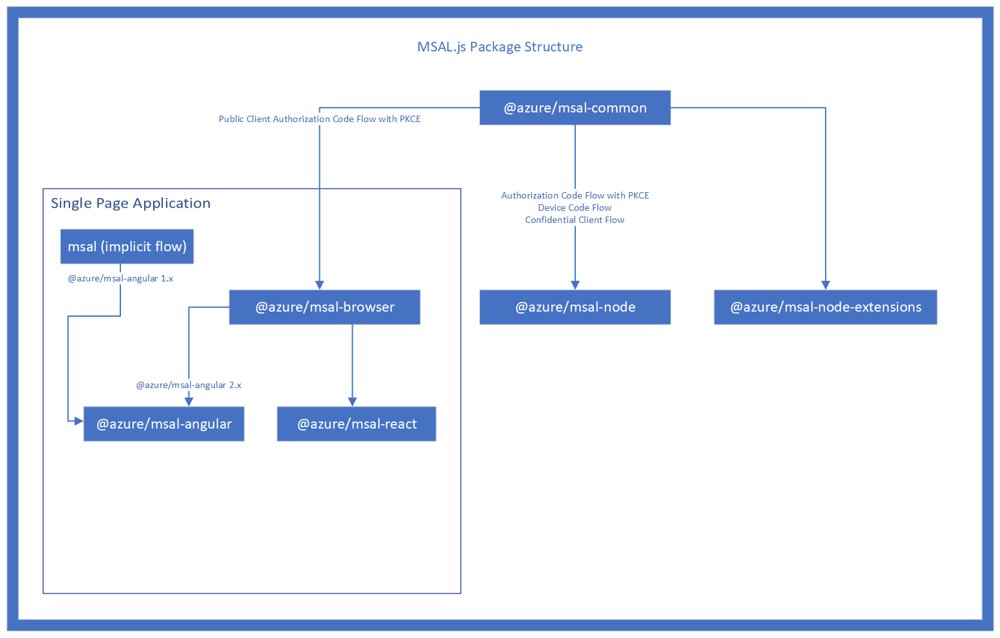

# MSAL
* [https://github.com/AzureAD/microsoft-authentication-library-for-js[(https://github.com/AzureAD/microsoft-authentication-library-for-js)

Microsoft Authentication Library for JavaScript (MSAL.js)

## msal-express-wrapper
*Wrapper for express*

* [https://github.com/Azure-Samples/msal-express-wrapper](ttps://github.com/Azure-Samples/msal-express-wrapper)

