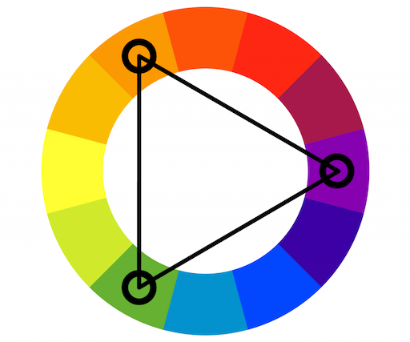

# Material UI
* [Material UI Theme Editor](https://bareynol.github.io/mui-theme-creator/)
* [Material palette generator](https://material.io/inline-tools/color/)
* [Color Tool](https://m2.material.io/resources/color)
* [default-theme](https://mui.com/material-ui/customization/default-theme/)
* [The Color System](https://m2.material.io/design/color/the-color-system.html)

## The System
* [https://mui.com/system/basics](https://mui.com/system/basics)

## Triadic Color Wheel
A traditionally-balanced triadic color scheme focuses on one dominant color, with the other two evenly spaced colors both serving as accents.



## Breakpoints
```
xs, extra-small: 0px
sm, small: 600px
md, medium: 900px
lg, large: 1200px
xl, extra-large: 1536px
```
## CSS Baseline
```<CssBaseline />```

Global reset, a collection of HTML element and attribute style-normalizations. Removes margin: 8px on body.


## styled-components

## sx prop

## Palette colors
The theme exposes the following palette colors (accessible under theme.palette.):

```primary``` - used to represent primary interface elements for a user. It's the color displayed most frequently across your app's screens and components.

```secondary``` - used to represent secondary interface elements for a user. It provides more ways to accent and distinguish your product. Having it is optional.

```error``` - used to represent interface elements that the user should be made aware of.

```warning``` - used to represent potentially dangerous actions or important messages.

```info``` - used to present information to the user that is neutral and not necessarily important.

```success``` - used to indicate the successful completion of an action that user triggered.

# Theming
* [https://mui.com/material-ui/customization/theming](https://mui.com/material-ui/customization/theming)

