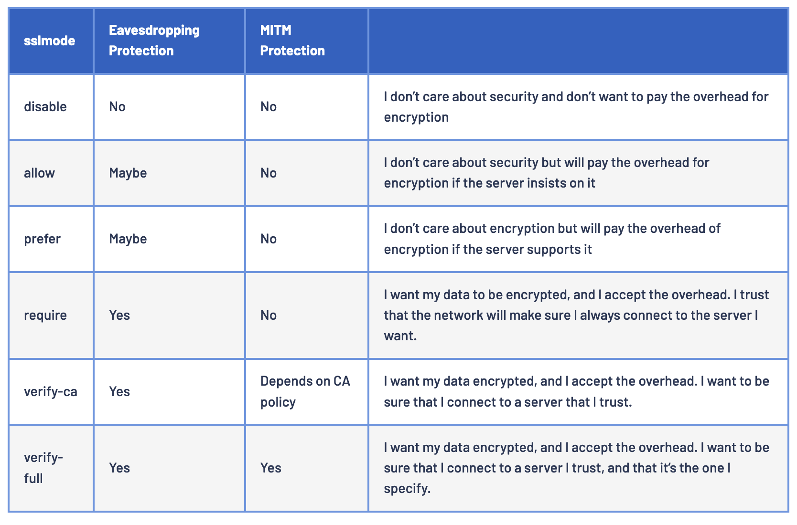

# postgresql
# Brew
```
brew install postgresql
```

Start
```
brew services start postgresql
```

If failed to start via brew
```
rm /usr/local/var/postgresql@12/postmaster.pid
```
## Login
```
psql postgres
```
## Databases
List all databases with sizes 
```
\l+
```

Connect to DB
```
\c dbname
```

Create database
```
CREATE DATABASE mydb;

# Command line samples
createdb -U postgres mydb 
podman exec Bemanning createdb -U postgres Bemanning
```

Delete database
```
drop database mydb;

or from terminal:

dropdb -U db_owner_username -i [-h host] mysitedb
```

## Users
List users
```
\du+
```

List users with sql
```
SELECT usename AS role_name,
 CASE
  WHEN usesuper AND usecreatedb THEN
    CAST('superuser, create database' AS pg_catalog.text)
  WHEN usesuper THEN
    CAST('superuser' AS pg_catalog.text)
  WHEN usecreatedb THEN
    CAST('create database' AS pg_catalog.text)
  ELSE
    CAST('' AS pg_catalog.text)
 END role_attributes
FROM pg_catalog.pg_user
ORDER BY role_name desc;
```

Create User
```
CREATE USER postgres WITH PASSWORD 'supersecret';
```

Create SUPERUSER:
```
CREATE USER root;
ALTER USER root WITH SUPERUSER;
```

Set detailed permissions
```
ALTER USER myrole WITH OPTION1 OPTION2 OPTION3;
These options range from CREATEDB, CREATEROLE, CREATEUSER

ALTER USER librarian WITH NOSUPERUSER;
```

## Tables
Create table
```
CREATE TABLE films (
    code        char(5) CONSTRAINT firstkey PRIMARY KEY,
    title       varchar(40) NOT NULL,
    did         integer NOT NULL,
    date_prod   date,
    kind        varchar(10),
    len         interval hour to minute
);
```

List all Tables
```
\dt
```

Describe a Table
```
\d tablename
```

## Get config_file, data_directory and log_destination
```
show config_file;
SELECT setting FROM pg_settings WHERE name = 'data_directory';
show log_destination;
```

## Backup and Restore
Dump/Backup
```
pg_dump -U dbuser dbname > dumpfile

```

Restore Backup
```
pg_restore --verbose --clean --no-acl --no-owner -h localhost -U postgres -d dbname ./dumpfile
```

## SSL
Ref.: 
* [https://jdbc.postgresql.org/documentation/ssl/](https://jdbc.postgresql.org/documentation/ssl/)
* [https://www.percona.com/blog/enabling-and-enforcing-ssl-tls-for-postgresql-connections/](https://www.percona.com/blog/enabling-and-enforcing-ssl-tls-for-postgresql-connections/)
* [https://demirhuseyinn-94.medium.com/postgresql-ssl-configuration-to-connect-database-114f867d96e0](https://demirhuseyinn-94.medium.com/postgresql-ssl-configuration-to-connect-database-114f867d96e0)

NB:  Before trying to access your SSL enabled server from Java, make sure you can get to it via psql!

```
psql -h localhost -U postgres
psql (14.5)
SSL connection (protocol: TLSv1.2, cipher: ECDHE-RSA-AES256-GCM-SHA384, bits: 256, compression: off)
Type "help" for help.

postgres=#
```

### Enable SSL

Creating certificates:
```
cd /var/lib/postgresql/data
openssl req -nodes -new -x509 -keyout server.key -out server.crt -subj "/C=US/L=NYC/O=Percona/CN=postgres"
chmod 400 server.{crt,key}
chown postgres:postgres server.{crt,key}
ls -la server.{crt,key}
```


Alter system:
```
alter system set ssl=on;
```

Reaload config
```
select pg_reload_conf();
```

openssl
```
openssl s_client -connect postgres:5432 -starttls postgres
```

### Enforce SSL
View pg_hba_file_rules from the pg_hba.conf file:
```
table pg_hba_file_rules;
```

Edit pg_hba.conf and add hostssl to all:
```
vi /var/lib/postgresql/data/pg_hba.conf

Shell
# TYPE   DATABASE       USER    ADDRESS            METHOD
local    all            all                        peer
host     all            all     127.0.0.1/32       scram-sha-256
host     all            all     ::1/128            scram-sha-256
hostssl  all            all     0.0.0.0/0          md5
hostssl  replication    all     10.124.33.113/24   md5
```

Result (observe the hostssl added at the bottom):
```
# TYPE  DATABASE        USER            ADDRESS                 METHOD

# "local" is for Unix domain socket connections only
local   all             all                                     trust
# IPv4 local connections:
host    all             all             127.0.0.1/32            trust
# IPv6 local connections:
host    all             all             ::1/128                 trust
# Allow replication connections from localhost, by a user with the
# replication privilege.
local   replication     all                                     trust
host    replication     all             127.0.0.1/32            trust
host    replication     all             ::1/128                 trust

hostssl all all all md5
```

Reload config:
```
select pg_reload_conf();
```

Check config:
```
table pg_hba_file_rules ;
```

### Test connection
psql (disable or require):
```
psql "host=postgres user=keycloak sslmode=disable"

psql "host=postgres user=keycloak sslmode=require"
```

connection info:
```
\conninfo
```

### Checking for connections using SSL/TLS
```
select pg_ssl.pid, pg_ssl.ssl, pg_ssl.version,
           pg_sa.backend_type, pg_sa.usename, pg_sa.client_addr
           from pg_stat_ssl pg_ssl
           join pg_stat_activity pg_sa
             on pg_ssl.pid = pg_sa.pid;
```


### SSL Mode
Possible values include disable , allow , prefer , require , verify-ca and verify-full. require , allow and prefer all default to a non-validating SSL factory and do not check the validity of the certificate or the host name. verify-ca validates the certificate, but does not verify the hostname. verify-full will validate that the certificate is correct and verify the host connected to has the same hostname as the certificate. Default is prefer.


