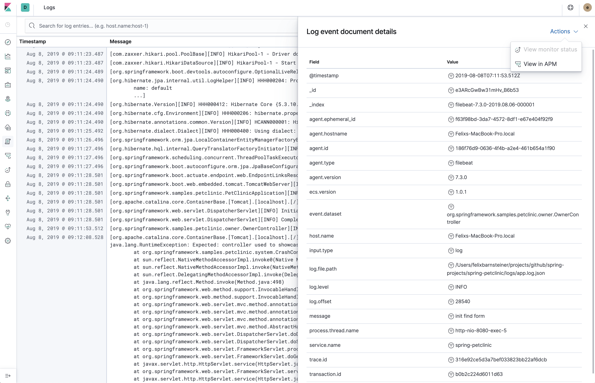

# Elastic Common Schema (ECS)
Centralized application logging with the Elastic stack made easy.

Elastic Common Schema (ECS) defines a common set of fields for ingesting data into Elasticsearch. For more information about ECS, visit the ECS 

ECS loggers are plugins for your favorite logging library. They make it easy to format your logs into ECS-compatible JSON. For example:
```json
{"@timestamp":"2019-08-06T12:09:12.375Z", "log.level": "INFO", "message":"Tomcat started on port(s): 8080 (http) with context path ''", "service.name":"spring-petclinic","process.thread.name":"restartedMain","log.logger":"org.springframework.boot.web.embedded.tomcat.TomcatWebServer"}
{"@timestamp":"2019-08-06T12:09:12.379Z", "log.level": "INFO", "message":"Started PetClinicApplication in 7.095 seconds (JVM running for 9.082)", "service.name":"spring-petclinic","process.thread.name":"restartedMain","log.logger":"org.springframework.samples.petclinic.PetClinicApplication"}
{"@timestamp":"2019-08-06T14:08:40.199Z", "log.level":"DEBUG", "message":"init find form", "service.name":"spring-petclinic","process.thread.name":"http-nio-8080-exec-8","log.logger":"org.springframework.samples.petclinic.owner.OwnerController","transaction.id":"28b7fb8d5aba51f1","trace.id":"2869b25b5469590610fea49ac04af7da"}
```




