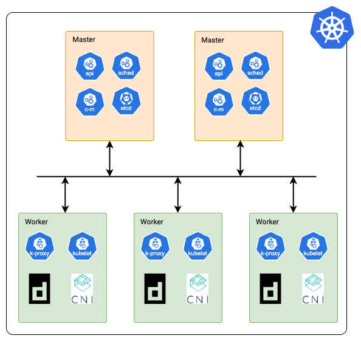
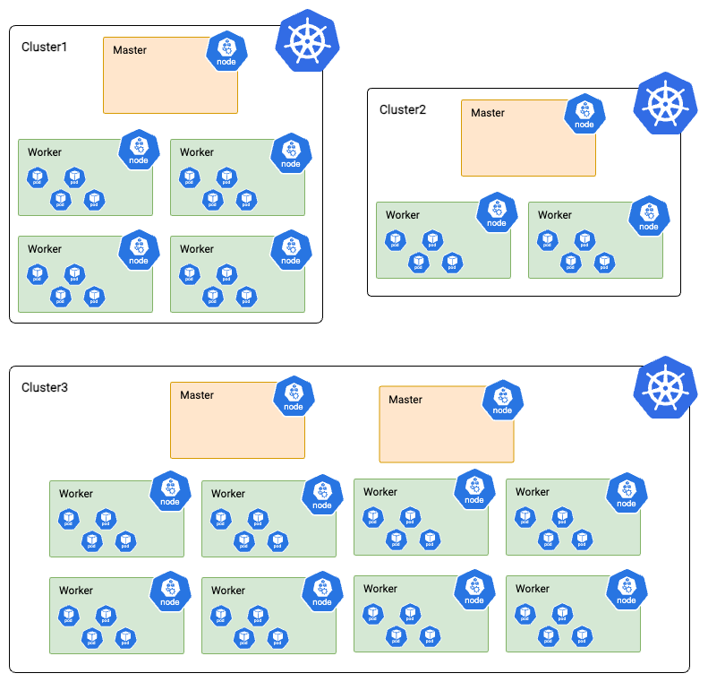
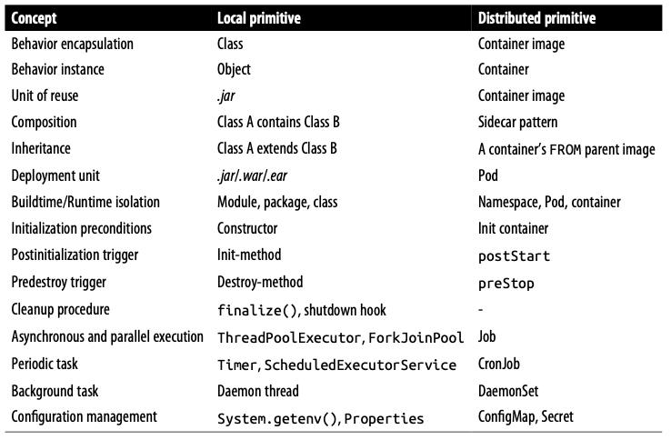

# Kubernetes
* Created by Google
* First Cloud Native project member
* [Kubernetes Pattern](kubernetes-patterns.pdf)

## How many Kubernetes clusters do you need
Administrators need to determind:
* The number of Kubernetes clusters to manage
* Node size
* Decide which workloads should run on which cluster
* Isolate apps for security and compliance measures

Factors:
* Compliance requirements: for example, to physically isolate data
* Primary purpose of the cluster: an internal developer platform or production?
* Workload constraints or requirements: certain workloads require specialized hardware (e.g. GPU) that’s only available in certain regions
* Customer requirements: some applications need to also run on-prem instead of SaaS
* Size of the infrastructure or platform team able to support the clusters: can my team support 100s of clusters or do we need a more centralized solution?
* Scale of the workloads running on Kubernetes: is your organization a small startup serving a few customers or a large corporation needing 1000s of nodes?
    
### Cluster

### Clusters

## Logical and distributed primitives:__

