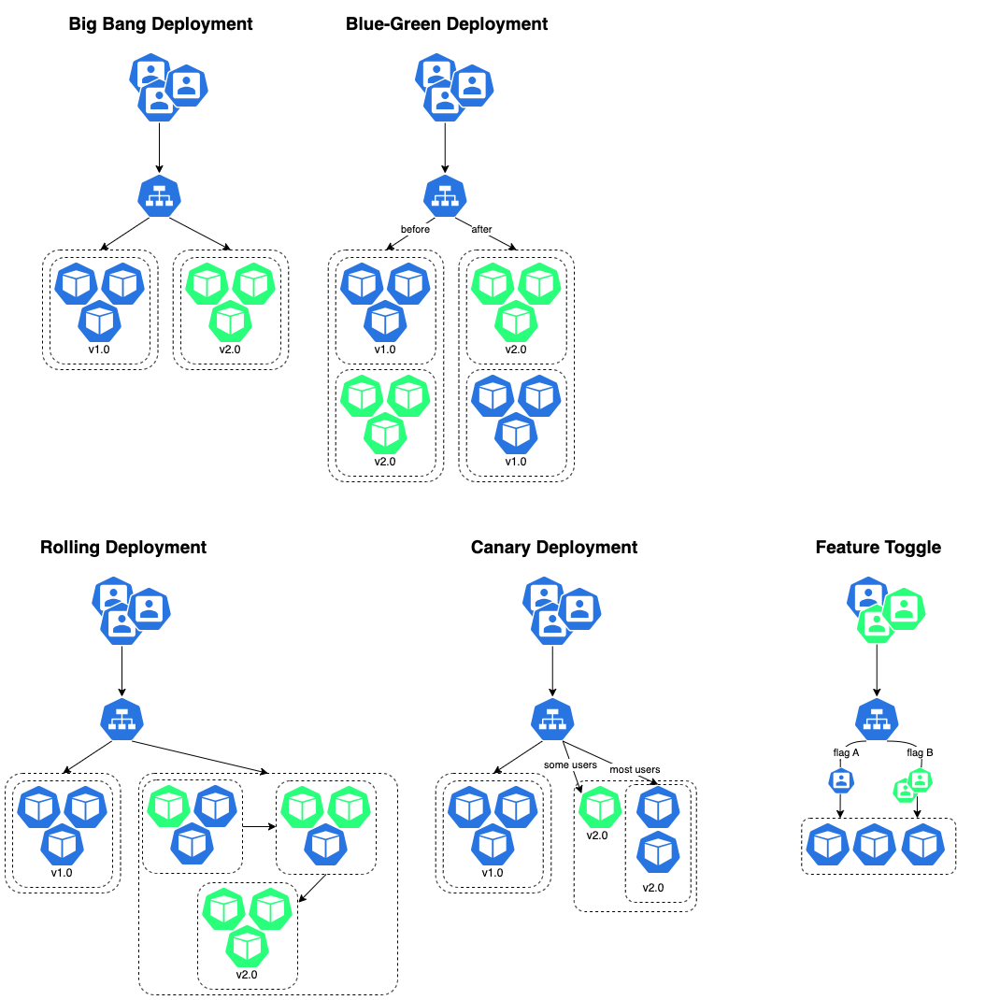

# Deployment

## Deployment Strategies
Ref.: [https://medium.com/@vinodvamanbhat/mastering-deployment-strategies-ensuring-smooth-application-rollouts-e9fefe1092b8](https://medium.com/@vinodvamanbhat/mastering-deployment-strategies-ensuring-smooth-application-rollouts-e9fefe1092b8)

### Big Bang Deployment
An all-at-once approach. It means the new software version is made live simultaneously, replacing the older version. While this approach can be simple, it also carries risks. If there's a problem, the entire system can be affected.

### Blue-Green Deployment
Two separate environments – the "blue" environment, which hosts the current version of your application, and the "green" environment, which hosts the new version. When it's time to release a new update, you switch traffic from blue to green, making the new version live.

### Canary Deployment
Releasing a new version to a small subset of users or a “canary group.” This approach helps identify and address issues before a full rollout.
* Create a new-deployment
* Reduce the replicas on the old-deployment

### Rolling Deployment
Release the new version incrementally to a subset of your infrastructure. You gradually move from one part of your infrastructure to another until the new version is deployed everywhere.

### Feature Toggle
Release the new version incrementally to a subset of your infrastructure. You gradually move from one part of your infrastructure to another until the new version is deployed everywhere.

