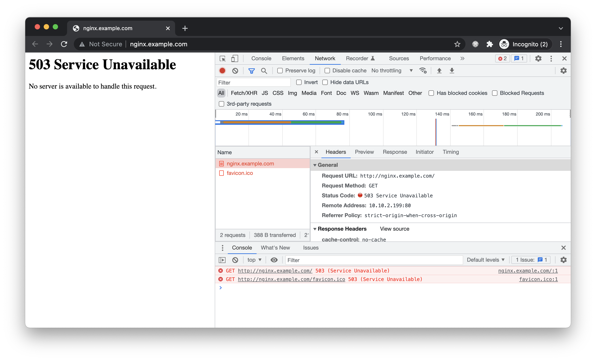

# haproxy
```
sudo apt update && sudo apt -y upgrade
sudo reboot
```

Install

    sudo apt -y install haproxy 

Config

    vi /etc/haproxy/haproxy.cfg

``` 
# Add to the end
# Define frontend
frontend apache_front
        # Frontend listen port - 80
        bind *:80
        # Set the default backend
        default_backend    kworkers
        # Enable send X-Forwarded-For header
        option             forwardfor
  
# Define backend
backend kworkers                                                                                                                     
        # Use roundrobin to balance traffic
        balance            roundrobin
        # Define the backend servers
        server             kworker210 10.10.2.210:80 check
        server             kworker211 10.10.2.211:80 check
        server             kworker212 10.10.2.212:80 check
        server             kworker213 10.10.2.213:80 check
```

Restart haproxy

    systemctl restart haproxy

## HAProxy w/ no Backend

