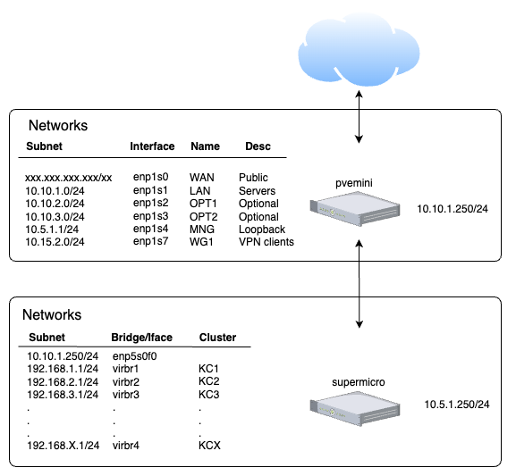
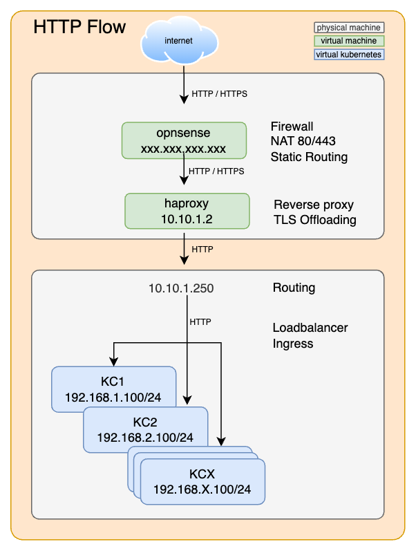
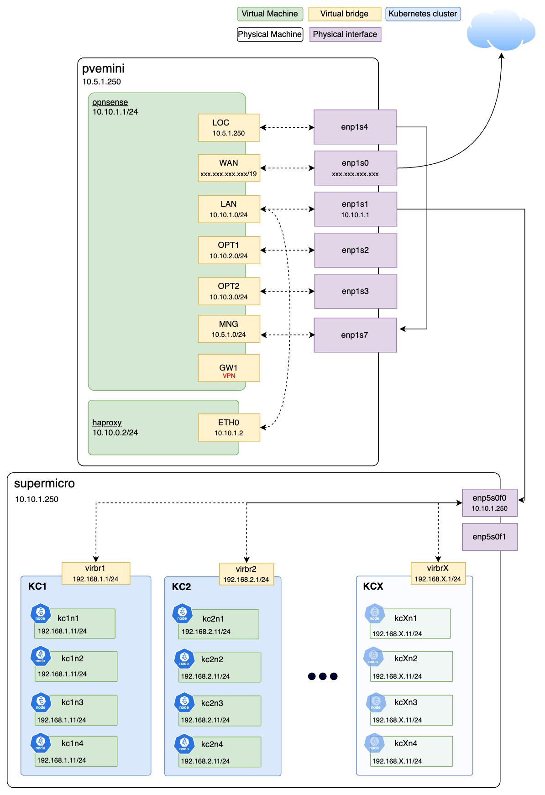
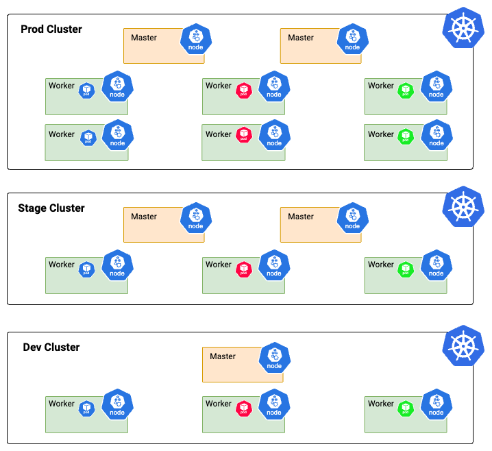
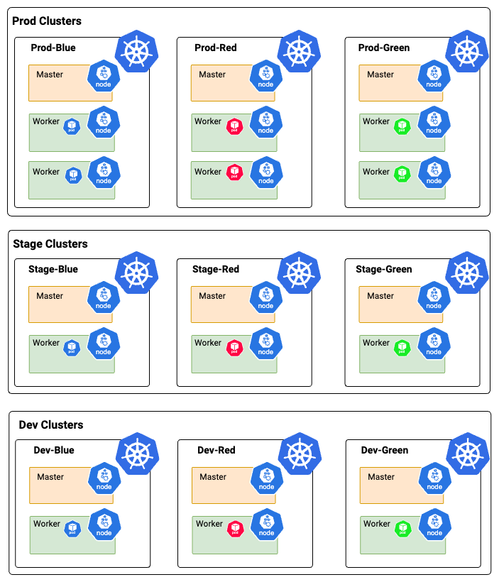

# Bare Metal
High level overview of running kubernetes on bare metal.

## Hypervisors and Network Overview

## HTTP Flow

## Physical and Virtual Network Diagram

## Cluster Configuration
### All Apps in One Cluster

### One App per Cluster

