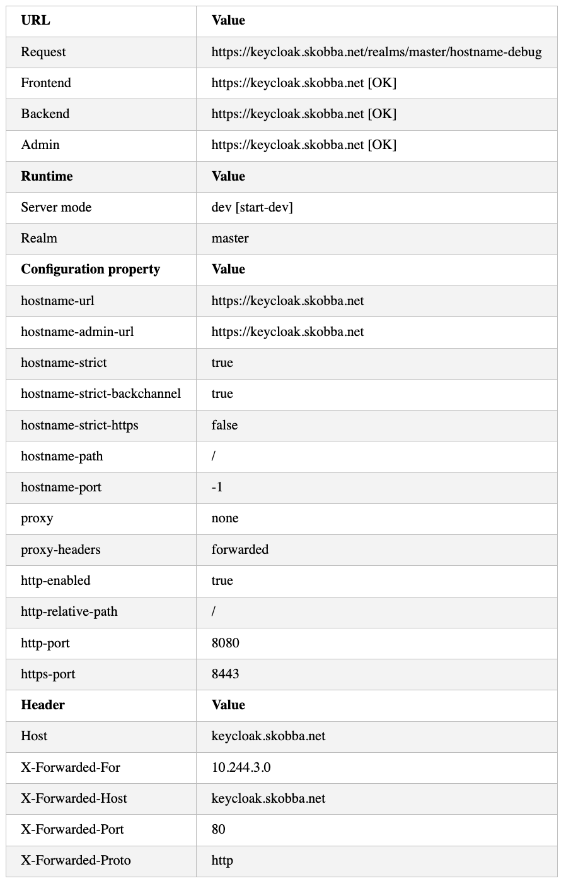

# Keycloak with haproxy as reverse proxy

## haproxy.cfg
```yaml
global
    stats socket /var/run/haproxy/admin.sock level admin mode 660
    setenv ACCOUNT_THUMBPRINT 'pastekey'

defaults
    mode http
    timeout client 10s
    timeout connect 5s
    timeout server 10s
    timeout http-request 10s

frontend stats
    mode http
    bind *:8404
    stats enable
    stats uri /stats
    stats refresh 10s
    stats admin if LOCALHOST

frontend fe_domains
    bind *:80
    bind :443 ssl crt /etc/haproxy/certs/ strict-sni

    # Set HTTP version to 1.1
    http-request set-header X-Forwarded-Proto http if !{ ssl_fc }
    http-request set-header X-Forwarded-Proto https if { ssl_fc }
    
    # Set Host header to the original host
    http-request set-header Host %[hdr(host)]
    http-request set-header X-Forwarded-Host %[hdr(host)]

    # Set X-Real-IP header to the client's IP address
    http-request set-header X-Real-IP %[src]

    # Set X-Forwarded-For header to include the client's IP address
    http-request set-header X-Forwarded-For %[src]

    # .well-known (acme.sh)
    http-request return status 200 content-type text/plain lf-string "%[path,field(-1,/)].${ACCOUNT_THUMBPRINT}\n" if { path_beg '/.well-known/acme-challenge/' }

    ## acl
    acl ACL_demo_skobba_net hdr(host) -i demo.skobba.net
    acl ACL_keycloak_skobba_net hdr(host) -i keycloak.skobba.net

    ## be
    use_backend be_demo_skobba_net if ACL_demo_skobba_net
    use_backend be_keycloak_skobba_net if ACL_keycloak_skobba_net

backend be_demo_skobba_net
    server server1 192.168.1.101:80

backend be_keycloak_skobba_net
    server server1 192.168.1.101:80
```

## Kubernetes yaml
```yaml
apiVersion: v1
kind: Service
metadata:
  name: keycloak
  labels:
    app: keycloak
spec:
  ports:
    - name: http
      port: 80
      targetPort: 8080
  selector:
    app: keycloak
  type: ClusterIP
---
apiVersion: networking.k8s.io/v1
kind: Ingress
metadata:
  name: keycloak-ingress
spec:
  ingressClassName: nginx
  rules:
  - host: keycloak.skobba.net
    http:
      paths:
      - path: /
        pathType: Prefix
        backend:
          service:
            name: keycloak
            port:
              number: 80
---
apiVersion: apps/v1
kind: Deployment
metadata:
  name: keycloak
  labels:
    app: keycloak
spec:
  replicas: 1
  selector:
    matchLabels:
      app: keycloak
  template:
    metadata:
      labels:
        app: keycloak
    spec:
      containers:
        - name: keycloak
          image: quay.io/keycloak/keycloak:24.0.3
          args: ["start-dev"]
          env:
            # - name: KC_HOSTNAME
            #   value: "keycloak.skobba.net"
            - name: KC_HOSTNAME_URL
              value: "https://keycloak.skobba.net"
            - name: KC_HOSTNAME_DEBUG
              value: "true"
            - name: KC_HOSTNAME_ADMIN_URL
              value: "https://keycloak.skobba.net"
            - name: KC_HOSTNAME_PATH
              value: "/"
            - name: KC_PROXY_HEADERS
              value: "forwarded"
            - name: KC_HOSTNAME_STRICT
              value: "true"
            - name: KC_HOSTNAME_STRICT_BACKCHANNEL
              value: "true"
            - name: KEYCLOAK_ADMIN
              value: "admin"
            - name: KEYCLOAK_ADMIN_PASSWORD
              value: "admin"
          ports:
            - name: http
              containerPort: 8080
          readinessProbe:
            httpGet:
              path: /realms/master
              port: 8080
```

## Debug
Enable hostname debug by setting ```KC_HOSTNAME_DEBUG```to ```true```.

URL: https://keycloak.skobba.net/realms/master/hostname-debug



