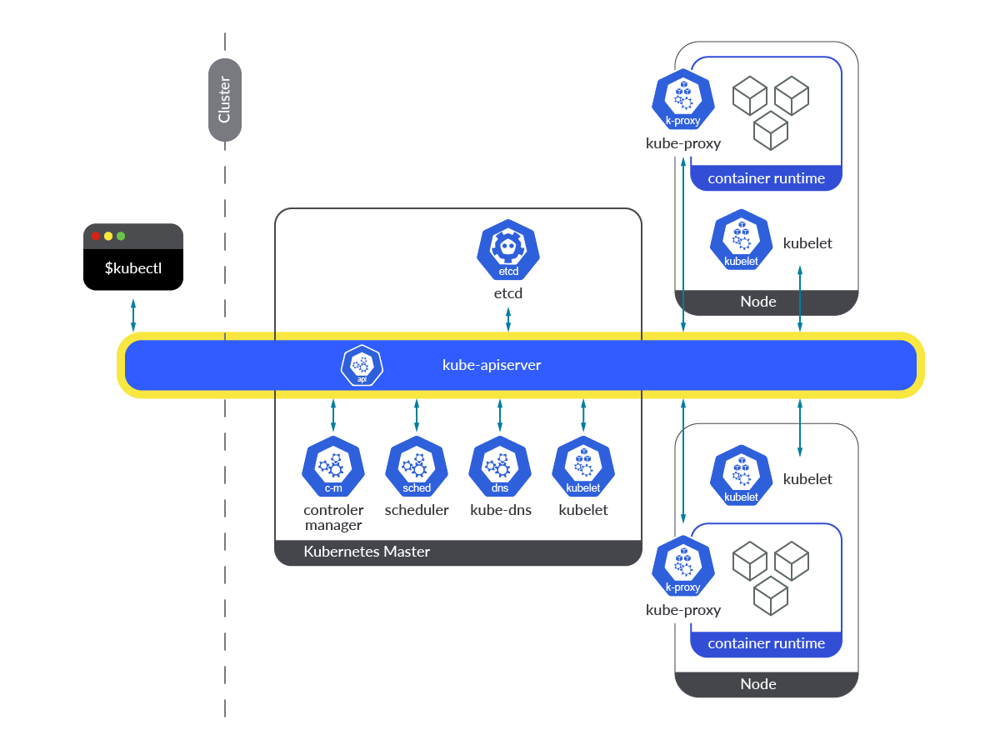

# kube-apiserver
Ref.: [https://sysdig.com/blog/monitor-kubernetes-api-server/](https://sysdig.com/blog/monitor-kubernetes-api-server/)

__The__ core of the control plane. It provides a front end service, via exposing an HTTP API interface, allowing end users, other internal components of Kubernetes, and external components to establish communication. The Kubernetes API interface provides a way to query and request information on Kubernetes objects, and at the same time, it is the gateway to be used when modifying the state of API objects in Kubernetes, like Pods, Deployments, ConfigMaps, Secrets, Namespaces, etc.

