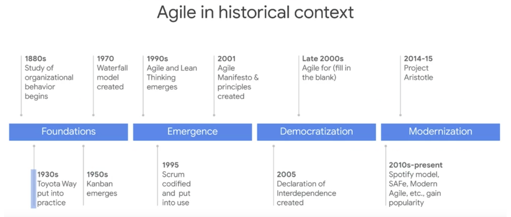
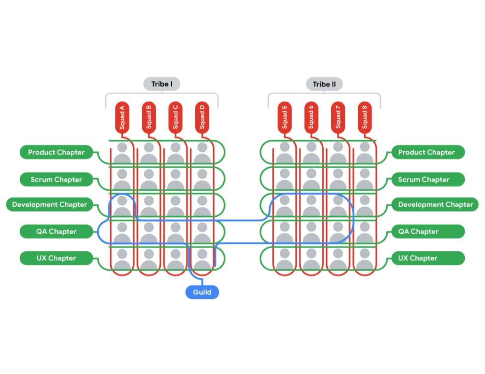

# Agile introduction

## Agile values and principles
The Agile values refer to the following four statements: 
* Individuals and interactions over processes and tools
* Working software over comprehensive documentation
* Customer collaboration over contract negotiation
* Responding to change over following a plan

## Agile manifesto
[http://agilemanifesto.org/principles.html](http://agilemanifesto.org/principles.html)

### 12 principles

* "Our highest priority is to satisfy the customer through early and continuous delivery of valuable software." 
Whether you are working to create a product for your company or for a customer, chances are that someone is awaiting its delivery. If that delivery is delayed, the result is that the customer, user, or organization is left waiting for that added value to their lives and workflows. Agile emphasizes that delivering value to users early and often creates a steady value stream, increasing you and your customer’s success. This will build trust and confidence through continuous feedback as well as early business value realization.

* "Welcome changing requirements, even late in development. Agile processes harness change for the customer’s competitive advantage." 
When working in Agile, it’s important to be agile. That means being able to move swiftly, shifting direction whenever necessary. That also means that you and your team are constantly scanning your environment to make sure necessary changes are factored into the plans. Acknowledging and embracing that your plans may change (once, twice, or several times) ensures that you and your customers are maximizing your success.

* "Deliver working software frequently, from a couple of weeks to a couple of months, with a preference to the shorter timescale." 
Delivering your product in small, frequent increments is important because it allows time and regular opportunities for stakeholders—including customers—to give feedback on its progress. This ensures that the team never spends too much time going down the wrong path.

* "Business people and developers must work together daily throughout the project." 
Removing barriers between developers and people focused on the business side of the project, builds trust and understanding and ensures that the developers, or those building the solution, are in tune with the needs of the users. 

* "Build projects around motivated individuals. Give them the environment and support they need, and trust them to get the job done." 
A successful Agile team includes team members that not only trust each other to get the work done but are also trusted by their sponsors and executives to get the work done. Teams build better solutions when they are empowered and motivated to deliver difficult projects.

* "The most efficient and effective method of conveying information to and within a development team is face-to-face conversation."
There isn’t anything quite like face-to-face communication. Face-to-face communication allows us to catch certain cues, body language, and facial expressions that are sometimes lost when using forms of communication like email, chat, or the phone. However, we can’t always be face-to-face. Establishing effective communication norms—no matter the format—is essential to effective teams. 

* "Working software is the primary measure of progress." 
In Agile teams, the main way to demonstrate meaningful completion of work is to show a working piece of the solution. In software teams, that might mean a functional piece of software. In non-software teams, that might mean a critical portion of the solution that is ready to be demonstrated to users or their representatives in order to collect feedback. This is in contrast to traditional or Waterfall projects, where the completion of project documents could be used to measure progress. In Agile project management, it is not enough to say that the team is 80% done with an activity if there is no working, demonstrable artifact available to review.

* "Agile processes promote sustainable development. The sponsors, developers, and users should be able to maintain a constant pace indefinitely." 
Maintaining a steady but careful pace will prevent errors along the way. Also, you never want your team to feel overworked or overwhelmed. On the flip side, a team that is underutilized may become bored and lose the creative spark to innovate. The Agile ideal is to achieve a steady pace of effort for the team that avoids overtime and burnout.

* "Continuous attention to technical excellence and good design enhances agility." 
This principle conveys that just because the team is working fast doesn’t mean they sacrifice quality. By emphasizing quality and design throughout the project development phase, the agility, efficiency, and speed of the team will be increased. When a team delivers a well-built solution, they can quickly respond to user feedback and new information. However, if the product is low quality, implementing changes can become problematic, complex, and slow down the entire team. 

* "Simplicity—the art of maximizing the amount of work not done—is essential." 
The team should avoid implementing extra features into the solution that weren’t explicitly requested by the user or product owner. This includes removing procedures that are no longer necessary, and reducing unnecessary documentation. 

* "The best architectures, requirements, and designs emerge from self-organizing teams." 
Team members should be able to get their work done by designing their own work processes and practices, without a manager dictating how they operate. Team members should also feel empowered to speak up with questions, concerns, or feedback.

* "At regular intervals, the team reflects on how to become more effective, then tunes and adjusts its behavior accordingly." 
In Agile, it is important to acknowledge that learning from successes and failures is continuous. No team is perfect. There will be mistakes, challenges, trials, and triumphs. Teams should reflect on all of these different aspects of their activities so that they can make necessary adjustments. 

## VUCA
volatility, uncertainty, complexity, and ambiguity

## SCRUM
[The New New Product Development Game](https://hbr.org/1986/01/the-new-new-product-development-game):

* __Built-in instability:__ In the Scrum world, teams are given the freedom to achieve important outcomes with “challenging requirements.” Takeuchi and Nonaka explain that this gives teams “an element of tension” necessary to “carry out a project of strategic importance to the company.” 

* __Self-organizing teams:__ Scrum Teams were intended to operate like their own start-up, with a unique order that lacks true hierarchy. These teams are considered self-organizing when they exhibit autonomy, continuous growth, and collaboration.  

* __Overlapping development phases:__ Individuals on a Scrum Team must “work toward synchronizing their pace to meet deadlines.” At some point throughout the process, each individual’s pace starts to overlap with others, and eventually, a collective pace is formed within the team.

* __Multi-learning:__ Scrum is a framework that relies heavily on trial and error. Scrum Team members also aim to stay up-to-date with changing market conditions and can then respond quickly to those conditions. 

* __Subtle control:__ As we mentioned, Scrum Teams are self-organizing and operate like a start-up, but that doesn’t mean there is no structure at all. By creating checkpoints throughout the project to analyze team interactions and progress, Scrum Teams maintain control without hindering creativity. 

* __Organizational transfer of learning:__ On Scrum Teams, everyone is encouraged to learn skills that may be new to them as they support other team members.

## Kanban
Kanban has two key benefits. First, it offers transparent visual feedback about the status of work in progress. Second, it ensures the team only accepts a sustainable amount of in-progress work.

## XP
The XP methodology aims to improve product quality and the ability to respond to changing customer needs. To that end, continuous integration and continuous refactoring help teams get quick feedback on the quality of the code or product.

## LEAN
From Toyota.

## Spotify

[The Spotify model](https://blog.crisp.se/wp-content/uploads/2012/11/SpotifyScaling.pdf) encourages innovation, collaboration, and productivity while maintaining autonomy, quality, and necessary communication. It does so by using a unique organization system that features Squads, Tribes, Chapters, and Guilds.

At Spotify, teams are broken down into what they call Squads. A Squad is like a Scrum Team and is supposed to feel like its own start-up within the company. Squads are self-organizing and collocated. They work together to achieve a long-term mission. At Spotify, a Squad may be in charge of a task such as improving the app’s usability for Android, improving the Spotify radio experience, or providing payment solutions. Just like a Scrum Team, the Squad doesn't have a formal leader, but they do have a Product Owner. Product Owners collaborate with one another to maintain a roadmap to track Spotify’s progress as a whole. Each team also has access to an Agile coach to encourage continuous improvements. Tribes are collections of squads that work in a specific area and are meant to have less than 100 people. Chapters are small groups of people across a tribe that have similar skills and work in the same general
competency area. Guilds are the largest group, comprised of people across the organization who want to share knowledge, tools, code, and practices.
