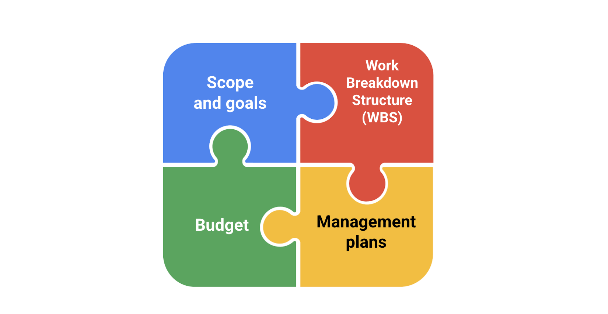
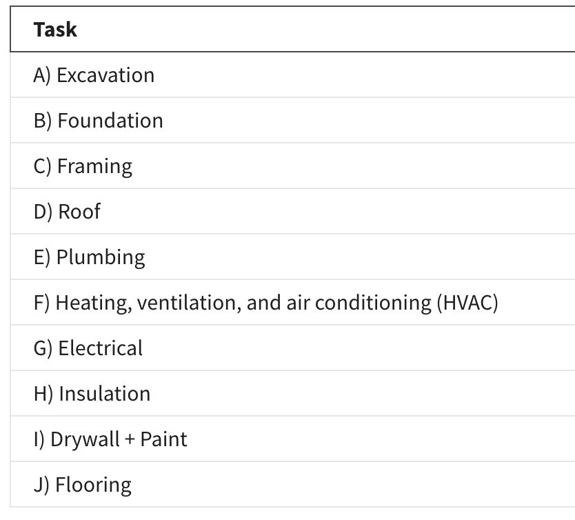
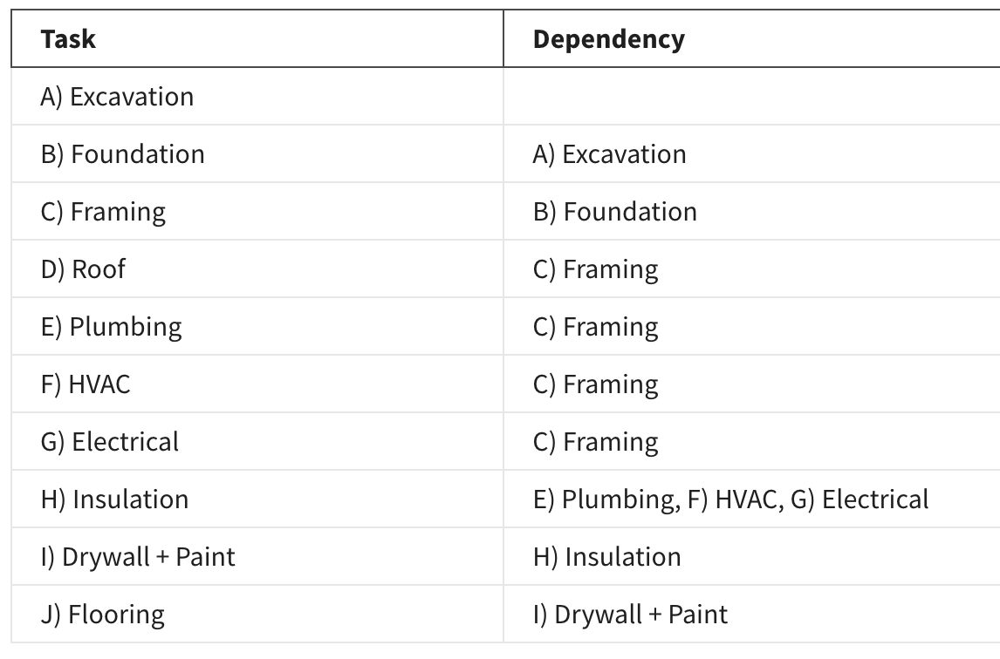
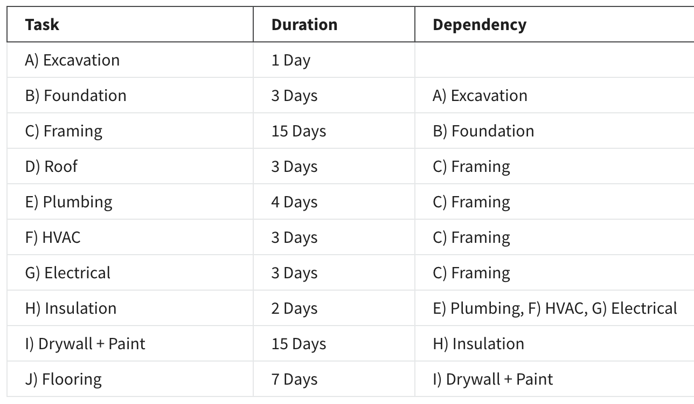
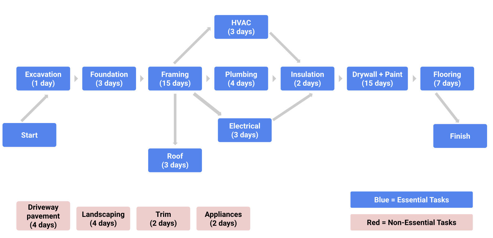

# Project Plan

__Project scope and goals__
Both the project scope and goals will be captured initially in your project charter.

__Work Breakdown Structure (WBS)__
In addition to the WBS, further documentation—such as a RACI chart—will help define roles and responsibilities and would be useful to add to your project plan. Keeping this documentation stored or linked in one place is a best practice for transparency and effective communication.

__Budget__
The project budget is often linked to the project plan because it is heavily dependent on key elements of the project.

__Management plans__
Management plans—such as the change management plan, risk management plan, and communication plan—are all integral to keeping a project organized and on track and should be linked in your project plan.

## Overcoming the planning fallacy
*It is human nature to underestimate the amount of time and effort it takes to complete a task—from anything as simple as walking the dog to something as complex as completing a project.*

*The planning fallacy describes our tendency to underestimate the amount of time it will take to complete a task, as well as the costs and risks associated with that task, due to optimism bias.*

Being on the lookout for “what-ifs” is a key project management skill.  Add task buffers to some of the project tasks to account for the potential risks. Remember to be “optimistically realistic” and push for the best outcome while still planning for the proper time to accomplish each task.

## Capacity planning and the critical path

### Critical Path
The critical path refers to the list of required project milestones you must reach to complete the project schedule, as well as the mandatory tasks that contribute to the completion of each milestone. 

__Step 1: Capture all tasks__

Capture all of the tasks associated with the completion of the effort.

__Step 2: Set dependencies__

For each task, ask:
* Which task needs to take place before this task?
* Which task can be finished at the same time as this task?
* Which task needs to happen right after this task?

__Step 3: Create a network diagram__

These diagrams help visualize:
* The path of the work from the start of the project (excavation) to the end of the project (flooring)
* Which tasks can be performed in parallel (e.g., HVAC and plumbing) and in sequence (e.g., plumbing then insulation)
* Which non-essential tasks are NOT on the critical path

__Step 4: Make time estimates__

Consult key stakeholders to get accurate time estimates for each task.

__Step 5: Find the critical path__
Forward pass and the backward pass. These techniques are useful if you are asked to identify the earliest and latest start dates (the earliest and latest dates on which you can begin working on a task) or the slack (the amount of time that task can be delayed past its earliest start date without delaying the project).

* __The forward pass__ refers to when you start at the beginning of your project task list and add up the duration of the tasks on the critical path to the end of your project. When using this approach, start with the first task you have identified that needs to be completed before anything else can start. 

* __The backward pass__ is the opposite—start with the final task or milestone and move backwards through your schedule to determine the shortest path to completion. When there is a hard deadline, working backwards can help you determine which tasks are actually critical. You may be able to cut some tasks—or complete them later—in order to meet your deadline.  

Ref.:
* [How to Use Critical Path Method for Complete Beginners](https://www.workamajig.com/blog/critical-path-method)
* [Critical Path Method for Project Management](https://www.wrike.com/blog/critical-path-is-easy-as-123/)

