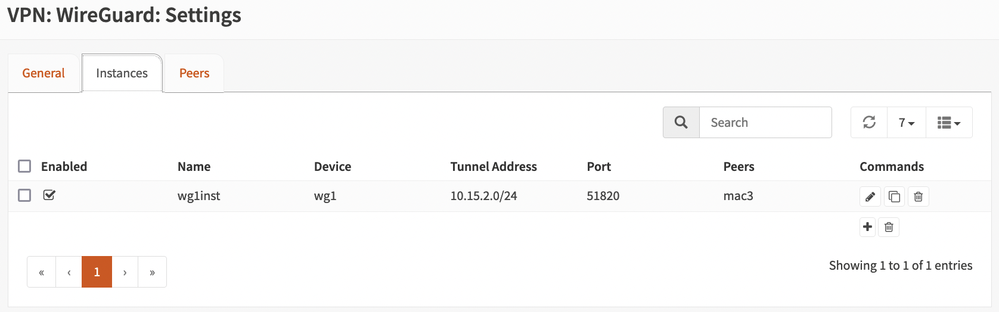
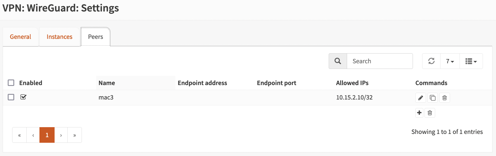
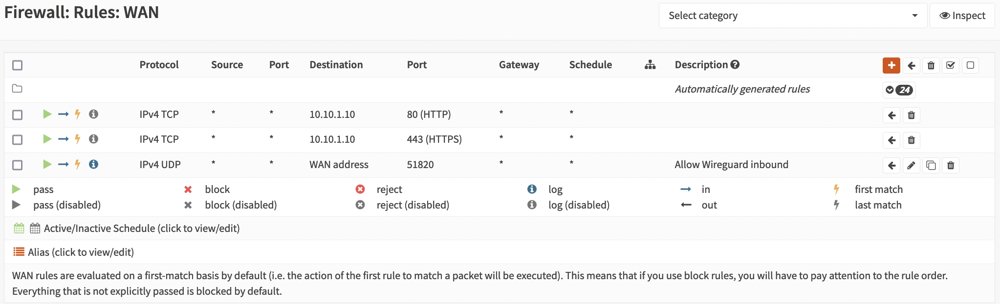
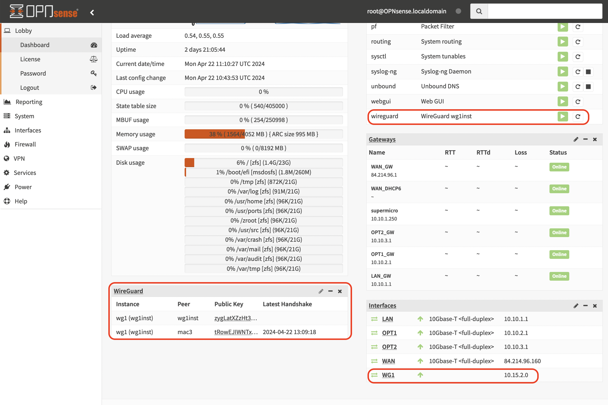

# OPNSense

## DNS
Ref.: 
* [How to Configure DNS over TLS (DoT) Using Unbound DNS in OPNsense](https://homenetworkguy.com/how-to/configure-dns-over-tls-unbound-opnsense/)
* [HAProxy + Let's Encrypt Wildcard Certificates](https://forum.opnsense.org/index.php?topic=23339.0)

## Setup Wireguard
Ref.: https://www.youtube.com/watch?v=b58PpuIsQ3A

Enable Wireguard plugin:
```
System -> Firmware -> Plugins 
```

### Add Instance
Add:
* Name: wg1
* Listen port: 51820
* Tunnel address: 10.15.2.0/24
* Generate server SSL


### Add Interface
* Add device wg1 to a new interface WG1.
* NB: Enabel WG1 interface!!

### Install wireguard-tools
```
brew install wireguard-tools
```

### Generate client-keys
```sh
wg genkey | tee clientprivatekey | wg pubkey > clientpublickey
```

### Create Peer
* Name: mac1
* Allowed IPs: 10.15.2.10/32
* Public key: <client public key>


### Create Configuration File
```
[Interface]
PrivateKey = <client private key>
Address = 10.15.2.10/32
DNS = 10.10.1.1

[Peer]
PublicKey = <server public key>
Endpoint = 84.214.96.160:51820
AllowedIPs = 0.0.0.0/0
```

### Firewall rules
* WG1: Allow all in
* WAN: Allow in, proto: UDP, Destination port range: 51820, Destination: WAN Address


### Start/stop the Tunnel
```sh
sudo wg-quick up ./config-file.conf
sudo wg-quick down ./config-file.conf
```

### Verify Connection
```sh
wg show
```

