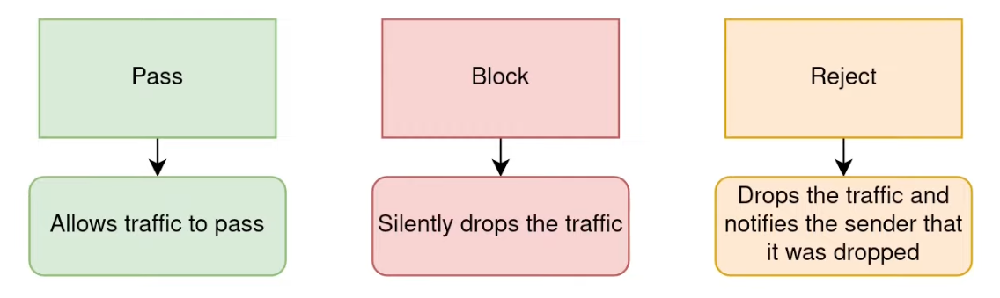

# Firewall
Ref.: [OPNSense Firewall Rules Explained](https://www.youtube.com/watch?v=kYFNa_zpeII)

## Aliases
Create an alias called __RFC1918__ that will hold all the private IP networks.

## Rulse
NB: Descriptions can be filtered out in logs.
