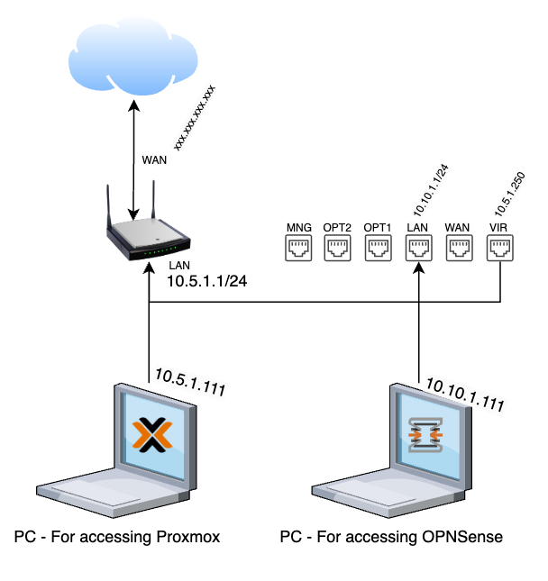
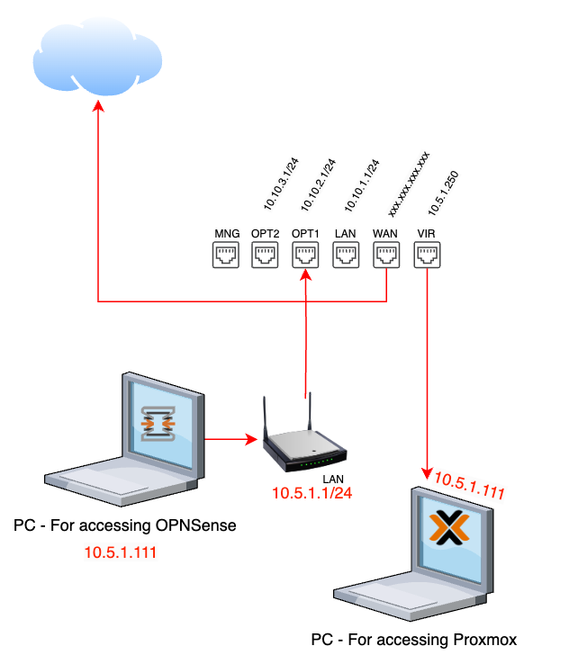
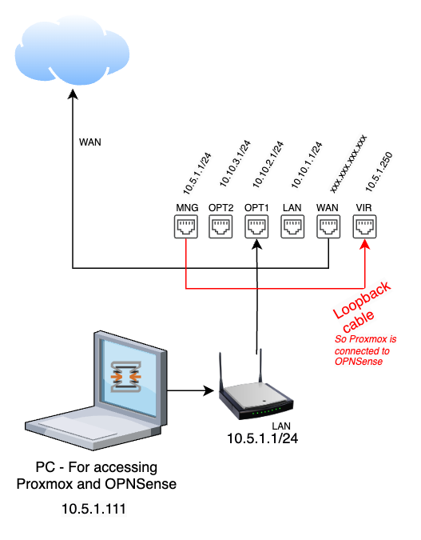

# Setup OPNSense on Proxmox

## Install OPNSense
Download the amd64 - dvd -> [https://opnsense.org/download](https://opnsense.org/download)

Unzip to iso with:
```sh
bzip2 -d OPNsense-xxxxxxxx.iso
```

Create virtual bridges in Proxmox.

Create vm in Proxmox.

Start the vm, let it boot into live mode and login as installer/opnsense, and the installer will start.

Select:
* ZFS
* stripe

NB: After install is completed, don´t let it reboot! Press Ctl-C to abort reboot and run ```shutdown``` from terminal so you can remove the CDROM from the vm before starting.

## Setup OPNSense
### Initial Setup
Tasks:
* Install TP cabels
* Setup WiFi Router with LAN IP: 10.5.1.1/24
* Setup ```LAN```and ```OPT1```

Status:
* OPNSense __does not__ have internet
* Proxmox has internet



### Intermediat Setup
Task:
* Change TP cables (marked in red)
* Change WiFi Router LAN IP range from ```10.5.1.1/24```fro ```0.10.1.1/24```

Status:
* Proxmox __does not__ have internet
* WAN cable now goes to OPNSense and not WiFi Router
* OPNSense has internet
* Setup is more or less complete with the following interfaces
** WAN <- for internet access
** LAN <- for servers
** OPT2 <- for wifi router.



### Final Setup
Tasks:
* Setup ```MNG``` interface on OPNSense with IP range ```10.5.1.1/24```
* Add loopback cable (in red)
* Chech that you can access both Proxmox and OPNSense

Status:
* OPNSense has internet
* Proxmox has internet (via the loopback cabel from ```VIR``` to ```MNG```


