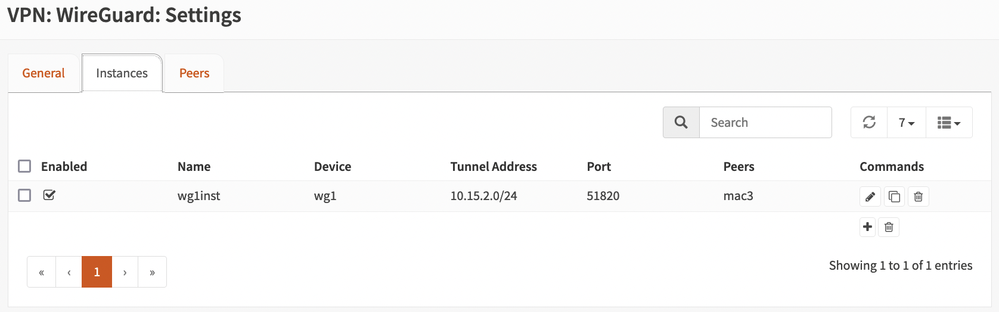
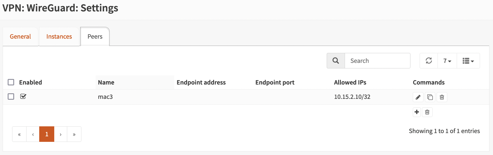
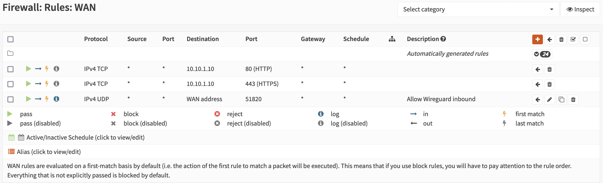
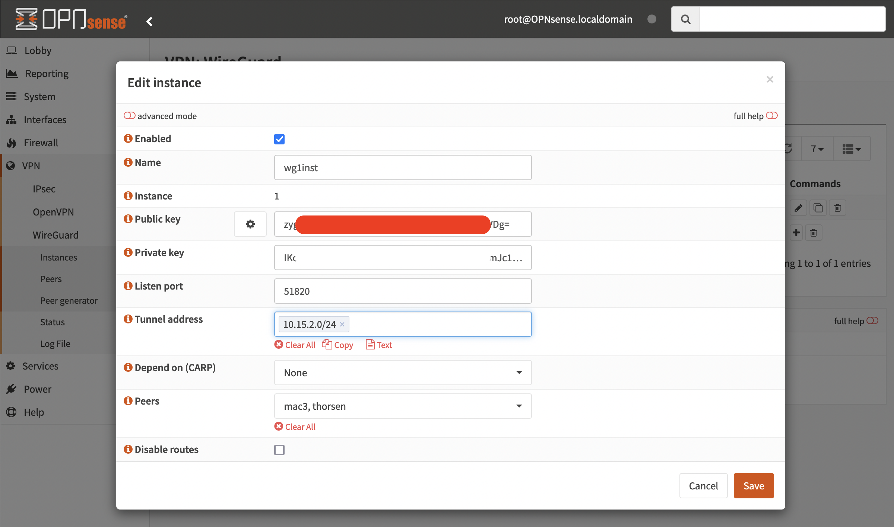
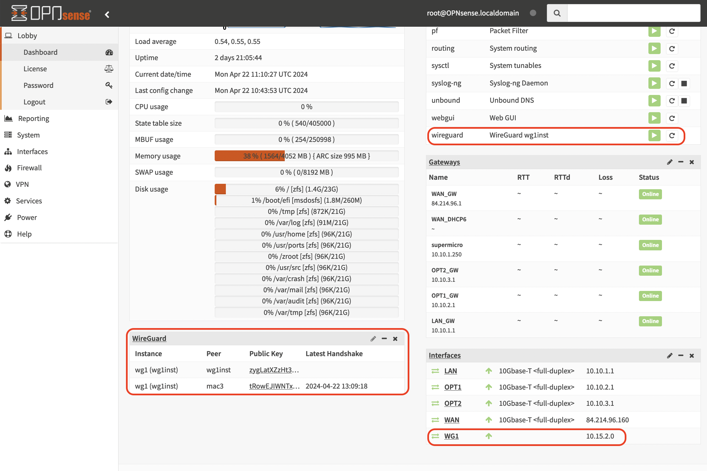

# Setup Wireguard

## Setup Server
### Enable Wireguard
Ref.: https://www.youtube.com/watch?v=b58PpuIsQ3A

Enable Wireguard plugin:
```
System -> Firmware -> Plugins 
```

### Add Instance
Add:
* Name: wg1
* Listen port: 51820
* Tunnel address: 10.15.2.0/24
* Generate server SSL (you will use the Public Key in your peers, read clients, config file)

* Check "Enable Wireguard" and "Apply" to create interface (or you will get an error in the next step).

### Add Interface
* Add device wg1 to a new interface WG1.
* NB: Enabel WG1 interface!!

## Setup mac client
### Generate client-keys
```sh
wg genkey | tee clientprivatekey | wg pubkey > clientpublickey
```

### Create Peer in OPNsense
* Name: mac1
* Allowed IPs: 10.15.2.10/32
* Public key: <clientpublickey>



### Firewall rules in OPNsense
* WG1: Allow all in
* WAN: Allow in, proto: UDP, Destination port range: 51820, Destination: WAN Address


### Install wireguard-tools on mac
```
brew install wireguard-tools
```

### Create Configuration File
NB: Change the __Address__ for each client

```
[Interface]
PrivateKey = <clientprivatekey>
Address = 10.15.2.10/32
DNS = 10.10.1.1

[Peer]
PublicKey = <serverpublickey>
Endpoint = 84.214.96.160:51820
AllowedIPs = 0.0.0.0/0
```
Get the __PublicKey__ from:


### Start/stop the Tunnel
```sh
sudo wg-quick up ./config-file.conf
sudo wg-quick down ./config-file.conf
```

### Verify Connection
```sh
wg show
```


### up/down script
#### up.sh
```sh
networksetup -setdnsservers "iPhone USB" 1.1.1.1 8.8.8.8
networksetup -setdnsservers "Wi-Fi" 1.1.1.1 8.8.8.8

sudo wg-quick up ./config-file.conf
```
#### down.sh
```sh
sudo wg-quick down ./config-file.conf

networksetup -setdnsservers "iPhone USB" 10.10.1.1
networksetup -setdnsservers "Wi-Fi" 10.10.1.1
```

### scriptmanager
```sh
brew install danielfiller30/tap/scriptmanager
```

### Apple script for easy access (not working)
1. Create an Automator Application:

Open Automator
Choose "Application" as the document type.
Search for "Run Shell Script" in the Library pane and drag it to the workflow area.
Paste your bash script into the Run Shell Script action.

2. Save the Automator Application:

Save the Automator application with a descriptive name like "VPN Starter".

3. Create an AppleScript to Trigger the Automator Application:

Open AppleScript Editor (you can find it in the Applications folder or by searching with Spotlight).
Write an AppleScript to trigger your Automator application. It should be something like:
```
tell application "System Events"
    tell application process "VPN Starter" -- Replace "VPN Starter" with the name of your Automator application
        click menu bar item 1 of menu bar 1
        click menu item "Start VPN" of menu 1 of menu bar item 1 of menu bar 1 -- Change "Start VPN" to the name of your menu item if it's different
    end tell
end tell
```
