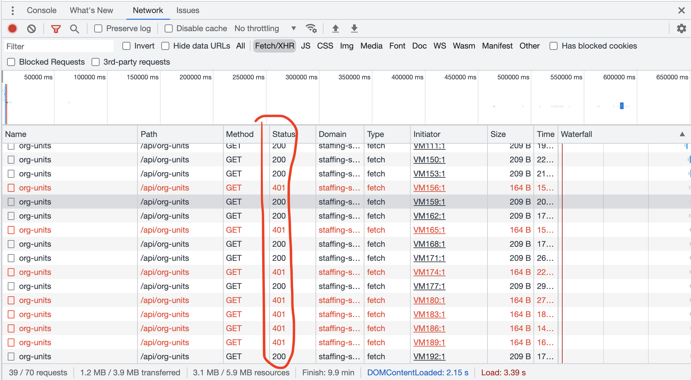

# Session Management

## Session vs Cookie

| Session  | Cookie  |
|---|---|
|  Sessions require additional setup for loadbalancing. | Cookies are stored on the client machine so loadbalancing require no aditional setup.  |
| A session stores the variables and their values within a file in a temporary directory on the server.  | Cookies are stored on the user's computer as a text file.  |
|  The session ends when the user logout from the application or closes his web browser. | Cookies end on the lifetime set by the user.  |
|  It can store an unlimited amount of data.	| It can store only limited data.|
| We can store as much data as we want within a session, but there is a maximum memory limit, which a script can use at one time, and it is 128 MB. |	The maximum size of the browser's cookies is 4 KB. |
| Sessions are more secured compared to cookies, as they save data in encrypted form.	 | Cookies are not secure, as data is stored in a text file, and if any unauthorized user gets access to our system, he can temper the data. |

## Symptoms with Sessions and load balancing
Observe that only some (50%) of the request get 200 and the rest 401.

