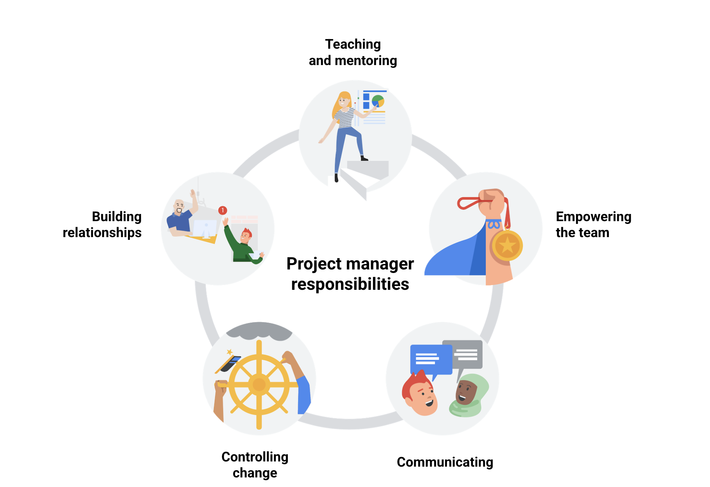

# Google Project Management Certificate

## Ref
* [https://www.coursera.org/google-certificates/project-management-certificate](https://www.coursera.org/google-certificates/project-management-certificate)
* [https://www.pmi.org](https://www.pmi.org)

## Responsibility
The project manager is responsible for planning, organizing, managing tasks, budgeting, controlling costs, and other factors to help keep the project within budget and on time. 

Project managers may be responsible for teaching and mentoring project team members, building relationships with the team and various stakeholders, controlling change and the impact to the project, empowering team members to make decisions, and communicating status and potential concerns. These interpersonal responsibilities can be just as important to the success of your projects as your more concrete responsibilities, like scheduling and budgeting.

## Skills
Key competencies: Flexibility and handling ambiguity

## Key competencies: Flexibility and handling ambiguity
As a project manager, having the flexibility and ability to handle ambiguity in a rapidly-changing business setting gives you an advantage. Mastering these competencies, along with enabling decision-making, effective communication skills, and strong organizational skills, will allow you to innovate and grow as a project manager and leader.

