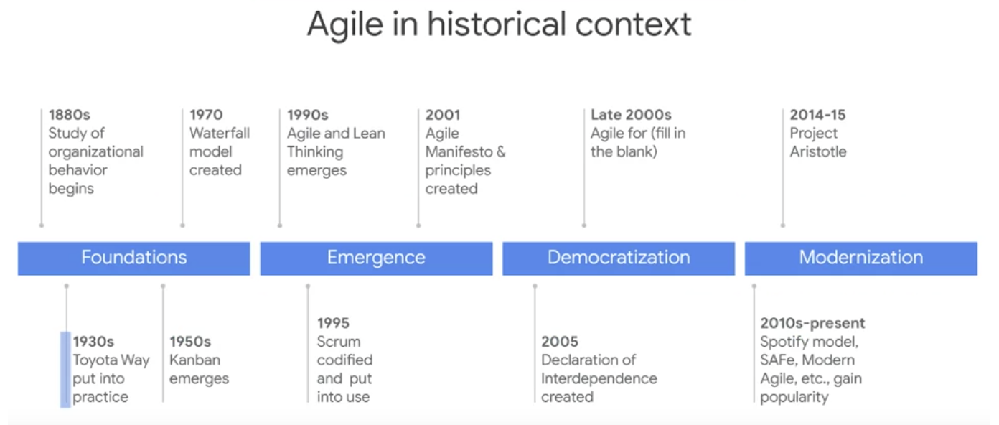

# Agile introduction

## Agile values and principles
The Agile values refer to the following four statements: 
* Individuals and interactions over processes and tools
* Working software over comprehensive documentation
* Customer collaboration over contract negotiation
* Responding to change over following a plan

