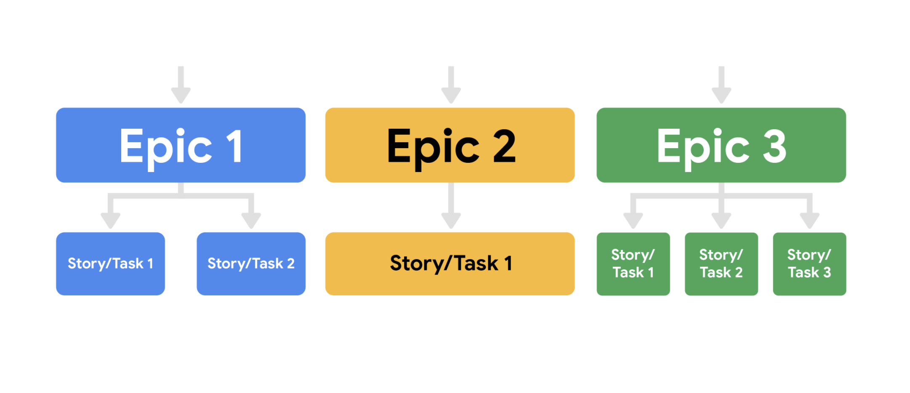
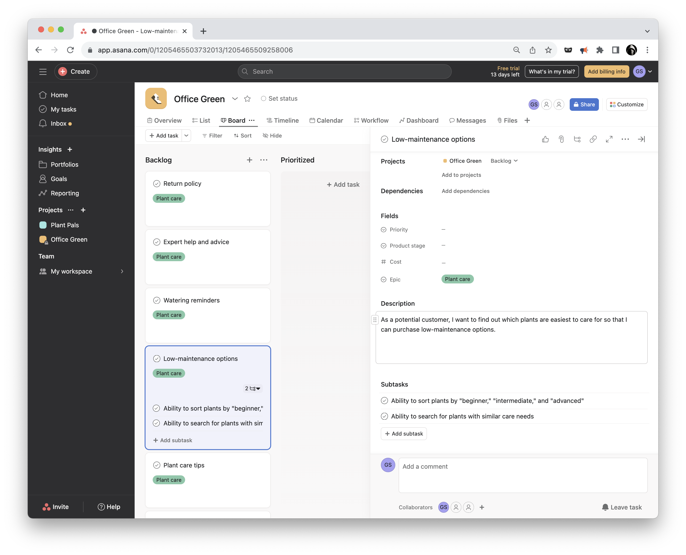

# Implementing Scrum

## Product Backlog
Ref.: [Product Backlog](https://www.scrumguides.org/scrum-guide.html#product-backlog)

## User Stories
The typical template for a user story looks like this: 
```
As a <user role>, I want this <action> so that I can get this <value>.
```
Example user story might read:
```
As an avid reader, I want to be able to read reviews before I check out a book from my local branch so that I know I am getting a book I am interested in.
```

Include the following elements: 
* User persona. What is your user like? What is their relation to the project? What goals do they have? 
* Definition of Done. This refers to an agreed upon set of items that must be completed before a user story can be considered complete. 
* Tasks. What are the key activities needed to complete the user story?
* Any feedback already provided. If you are adding features to an existing product and you have already received feedback from customers on a past iteration, make sure to consider this feedback.  

__I.N.V.E.S.T.__ 

Criteria: 
* __Independent:__ The story’s completion is not dependent on another story.
* __Negotiable:__ There is room for discussion about this item.
* __Valuable:__ Completing the user story has to deliver value. 
* __Estimable:__ The Definition of Done must be clear so that the team can give each user story an estimate. 
* __Small:__ Each user story needs to be able to fit within a planned Sprint.
* __Testable:__ A test can be conducted to check that it meets the criteria.

## Epics
An epic’s purpose is to help manage related user stories.

Epics allow you to keep track of large, loosely-defined ideas, while user stories are a much smaller unit of work, inspired directly from the end user or customer. 

Mike Cohn, the inventor of the term “epic” as it relates to Scrum, describes epic as a "very large user story"—one that could not be delivered within a single iteration and may need to be split into smaller stories.

*User stories may include customers wanting to read reviews of books on the website or wanting to add books to their cart. These user stories could fall into the “website creation” epic.*




## Asana


## Agile effort estimation techniques
__Relative estimation__ In relative estimation, instead of determining exactly how long a task will take, project managers compare the effort of a given task to the effort for another task. This becomes the estimate.

### Planning Poker™
This particular method is well-known and commonly used when Scrum teams have to make effort estimates for a small number of items (under 10). Planning Poker is consensus-based, meaning that everyone has to agree on the number chosen. In this technique, each individual has a deck of cards with numbers from the Fibonacci sequence on them. The Fibonacci sequence is where a number is the sum of the last two numbers (e.g., 0, 1, 1, 2, 3, 5, 8, 13, and so on). 

Sometimes, Planning Poker decks also include cards with coffee cups and question marks on them. The question mark card means that the person doesn’t understand what is being discussed or doesn’t have enough information to draw a conclusion. The coffee cup card means that the person needs a break.

The Planning Poker strategy is used in Sprint Planning meetings. As each Product Backlog item/user story is discussed, each team member lays a card face down on the table. Then, everyone turns their card over at the same time and the team discusses the estimates, particularly when they are far apart from one another. By first hiding the estimates, the group avoids any bias that is presented when numbers are said aloud. Sometimes, when hearing numbers aloud, people react to that estimate or the estimator themselves, and it changes what their initial thought may have been. In Planning Poker, teams can easily avoid that bias.

### Dot Voting 
Dot Voting, like Planning Poker, is also good for sprints with a low number of Sprint Backlog items. In Dot Voting, each team member starts with small dot stickers, color-coded by the estimated effort required (e.g., S=green, M=blue, L=orange, XL=red). The items or user stories are written out on pieces of paper placed around a table or put up on the wall. Then, team members walk around the table and add their colored stickers to the items.

### The Bucket System
The Bucket System is helpful for backlogs with many items since it can be done very quickly. In fact, a couple hundred items can be estimated in just one hour with the Bucket System. The Bucket System is an effective strategy for sizing items because it explores each item in terms of pre-determined "buckets" of complexity. Keep in mind that these buckets are metaphorical; this strategy doesn't require the use of actual buckets, and instead uses sticky notes or note cards as buckets.

In this technique, the team starts by setting up a line of note cards down the center of the table, each marked with a number representing a level of effort. Then, the team writes each item or user story on a card. Each person draws and reads a random item,  then places it somewhere along the line of numbered note cards. There is no need to discuss further with the team. If a person draws an item that they do not understand, then they can offer it to someone else to place. Additionally, if a person finds an item that they think does not fit where it was placed, they can discuss it with the team until a consensus about a more accurate placement is reached. Team members should spend no more than 120 seconds on each item.

### Large/Uncertain/Small 
Large/Uncertain/Small is another quick method of rough estimation. It is great for product backlogs that have several similar or comparable items. 

This is the same general idea as the Bucket System, but instead of several buckets, you only use three categories: large, uncertain, and small. Starting with the simpler, more obvious user stories, the team places the items in one of the categories. Then, the team discusses and places more complex items until each is assigned to a category.

### Ordering Method
The Ordering Method is ideal for projects with a smaller team and a large number of Product Backlog items. First, a scale is prepared and items are randomly placed ranging from low to high. Then, one at a time, each team member either moves any item one spot lower or higher on the scale or passes their turn. This continues until team members no longer want to move any items. 

### Affinity Mapping
Affinity Mapping is useful for teams that have more than 20 items in their Product Backlog. 

A best practice is to conduct this technique using sticky notes placed onto a wall, whiteboard, or table. Each sticky note features a different user story or item. Using sticky notes allows the team to move user stories around in order to group them by similar theme, group, and pattern. The team begins by placing one sticky note on the board. Then, the team takes the next sticky note and discusses whether it is similar to the first item. Based on the team’s assessment, the second sticky note is placed in the first group or into its own group. 

After all of the items are grouped (there should be anywhere from 3–10 groups total), the team gives a name to each group that represents the general theme of the items. Then, the groups are prioritized by importance so that the team knows which items to tackle first.

## Estimation
### T-shirt sizes
At first, T-shirt sizes may seem like a somewhat unusual way to measure an item or user story. But when you think about assigning estimations to items based on sizes (e.g., XS, S, M, L, XL, XXL), it is actually very helpful and easy. Some of the benefits to using this technique are that it is quick, well understood by Agile experts, and a good introduction for teams who are just learning relative estimation. 

Image of six individual t-shirts with a size on each. Ranging from XS-XXL
So what does the process of assigning T-shirt sizes entail? There are several specific techniques a team can try, but each generally follows these steps. The team: 
* Agrees on the chosen scale and metrics to be used.
* Identifies at least one anchor backlog item. That item will be assigned a T-shirt size. Some teams will choose two anchor items—one at the top of the range and one at the bottom of the range.
* Sorts through the remaining backlog items and agrees on T-shirt sizes for each of them. 

### Story points
Using story points as the estimate unit is a little more advanced than T-shirt sizes, but it is essentially the same concept. This method is good for experienced teams. When using story points, teams usually use the Fibonacci sequence. As a reminder, this sequence comes from adding the two previous numbers in the sequence together. For example, 1 + 2 = 3 and 2 + 3 = 5. The important thing to notice about this sequence is that, as the list continues on, the numbers spread further apart from each other. Because of this, story points provide more accuracy and specificity than T-shirt sizes. 

So what does the process of assigning story points entail? There are several specific techniques a team can try, but the basic steps are the same as with T-shirt sizes. The team: 
* Agrees on the permitted points values. Some teams cap the size at a certain number, like 21. Some teams decide to jump from 21 to 100 as the next larger value. This is a team decision.
* Identifies at least one anchor backlog item and agrees to assign it a points value. Some teams will choose two anchor items, one at the top of the range and one at the bottom of the range.
* Sorts through the remaining backlog items as a team, agrees on an estimate for each item, and captures it in the backlog management system. 
