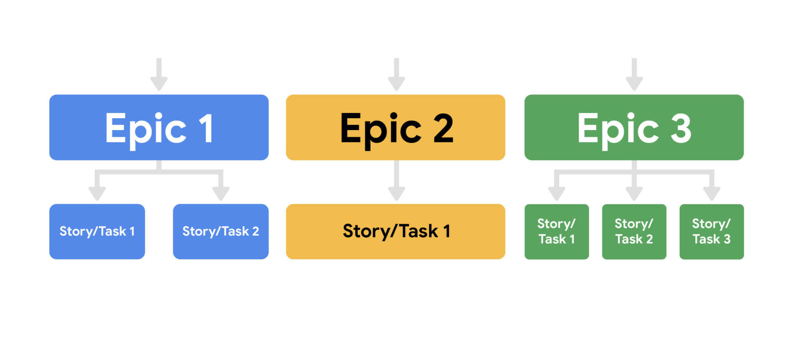
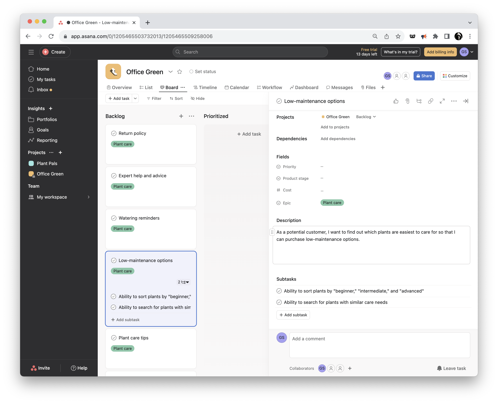

# Implementing Scrum

## Product Backlog
Ref.: [Product Backlog](https://www.scrumguides.org/scrum-guide.html#product-backlog)

## User Stories
The typical template for a user story looks like this: 
```
As a <user role>, I want this <action> so that I can get this <value>.
```
Example user story might read:
```
As an avid reader, I want to be able to read reviews before I check out a book from my local branch so that I know I am getting a book I am interested in.
```

Include the following elements: 
* User persona. What is your user like? What is their relation to the project? What goals do they have? 
* Definition of Done. This refers to an agreed upon set of items that must be completed before a user story can be considered complete. 
* Tasks. What are the key activities needed to complete the user story?
* Any feedback already provided. If you are adding features to an existing product and you have already received feedback from customers on a past iteration, make sure to consider this feedback.  

__I.N.V.E.S.T.__ 

Criteria: 
* __Independent:__ The story’s completion is not dependent on another story.
* __Negotiable:__ There is room for discussion about this item.
* __Valuable:__ Completing the user story has to deliver value. 
* __Estimable:__ The Definition of Done must be clear so that the team can give each user story an estimate. 
* __Small:__ Each user story needs to be able to fit within a planned Sprint.
* __Testable:__ A test can be conducted to check that it meets the criteria.

## Epics
An epic’s purpose is to help manage related user stories.

Epics allow you to keep track of large, loosely-defined ideas, while user stories are a much smaller unit of work, inspired directly from the end user or customer. 

Mike Cohn, the inventor of the term “epic” as it relates to Scrum, describes epic as a "very large user story"—one that could not be delivered within a single iteration and may need to be split into smaller stories.

*User stories may include customers wanting to read reviews of books on the website or wanting to add books to their cart. These user stories could fall into the “website creation” epic.*




## Asana


## Agile effort estimation techniques
__Relative estimation__ In relative estimation, instead of determining exactly how long a task will take, project managers compare the effort of a given task to the effort for another task. This becomes the estimate.

### Planning Poker™
This particular method is well-known and commonly used when Scrum teams have to make effort estimates for a small number of items (under 10). Planning Poker is consensus-based, meaning that everyone has to agree on the number chosen. In this technique, each individual has a deck of cards with numbers from the Fibonacci sequence on them. The Fibonacci sequence is where a number is the sum of the last two numbers (e.g., 0, 1, 1, 2, 3, 5, 8, 13, and so on). 

Sometimes, Planning Poker decks also include cards with coffee cups and question marks on them. The question mark card means that the person doesn’t understand what is being discussed or doesn’t have enough information to draw a conclusion. The coffee cup card means that the person needs a break.

The Planning Poker strategy is used in Sprint Planning meetings. As each Product Backlog item/user story is discussed, each team member lays a card face down on the table. Then, everyone turns their card over at the same time and the team discusses the estimates, particularly when they are far apart from one another. By first hiding the estimates, the group avoids any bias that is presented when numbers are said aloud. Sometimes, when hearing numbers aloud, people react to that estimate or the estimator themselves, and it changes what their initial thought may have been. In Planning Poker, teams can easily avoid that bias.

### Dot Voting 
Dot Voting, like Planning Poker, is also good for sprints with a low number of Sprint Backlog items. In Dot Voting, each team member starts with small dot stickers, color-coded by the estimated effort required (e.g., S=green, M=blue, L=orange, XL=red). The items or user stories are written out on pieces of paper placed around a table or put up on the wall. Then, team members walk around the table and add their colored stickers to the items.

### The Bucket System
The Bucket System is helpful for backlogs with many items since it can be done very quickly. In fact, a couple hundred items can be estimated in just one hour with the Bucket System. The Bucket System is an effective strategy for sizing items because it explores each item in terms of pre-determined "buckets" of complexity. Keep in mind that these buckets are metaphorical; this strategy doesn't require the use of actual buckets, and instead uses sticky notes or note cards as buckets.

In this technique, the team starts by setting up a line of note cards down the center of the table, each marked with a number representing a level of effort. Then, the team writes each item or user story on a card. Each person draws and reads a random item,  then places it somewhere along the line of numbered note cards. There is no need to discuss further with the team. If a person draws an item that they do not understand, then they can offer it to someone else to place. Additionally, if a person finds an item that they think does not fit where it was placed, they can discuss it with the team until a consensus about a more accurate placement is reached. Team members should spend no more than 120 seconds on each item.

### Large/Uncertain/Small 
Large/Uncertain/Small is another quick method of rough estimation. It is great for product backlogs that have several similar or comparable items. 

This is the same general idea as the Bucket System, but instead of several buckets, you only use three categories: large, uncertain, and small. Starting with the simpler, more obvious user stories, the team places the items in one of the categories. Then, the team discusses and places more complex items until each is assigned to a category.

### Ordering Method
The Ordering Method is ideal for projects with a smaller team and a large number of Product Backlog items. First, a scale is prepared and items are randomly placed ranging from low to high. Then, one at a time, each team member either moves any item one spot lower or higher on the scale or passes their turn. This continues until team members no longer want to move any items. 

### Affinity Mapping
Affinity Mapping is useful for teams that have more than 20 items in their Product Backlog. 

A best practice is to conduct this technique using sticky notes placed onto a wall, whiteboard, or table. Each sticky note features a different user story or item. Using sticky notes allows the team to move user stories around in order to group them by similar theme, group, and pattern. The team begins by placing one sticky note on the board. Then, the team takes the next sticky note and discusses whether it is similar to the first item. Based on the team’s assessment, the second sticky note is placed in the first group or into its own group. 

After all of the items are grouped (there should be anywhere from 3–10 groups total), the team gives a name to each group that represents the general theme of the items. Then, the groups are prioritized by importance so that the team knows which items to tackle first.

## Estimation
### T-shirt sizes
At first, T-shirt sizes may seem like a somewhat unusual way to measure an item or user story. But when you think about assigning estimations to items based on sizes (e.g., XS, S, M, L, XL, XXL), it is actually very helpful and easy. Some of the benefits to using this technique are that it is quick, well understood by Agile experts, and a good introduction for teams who are just learning relative estimation. 

Image of six individual t-shirts with a size on each. Ranging from XS-XXL
So what does the process of assigning T-shirt sizes entail? There are several specific techniques a team can try, but each generally follows these steps. The team: 
* Agrees on the chosen scale and metrics to be used.
* Identifies at least one anchor backlog item. That item will be assigned a T-shirt size. Some teams will choose two anchor items—one at the top of the range and one at the bottom of the range.
* Sorts through the remaining backlog items and agrees on T-shirt sizes for each of them. 

### Story points
Using story points as the estimate unit is a little more advanced than T-shirt sizes, but it is essentially the same concept. This method is good for experienced teams. When using story points, teams usually use the Fibonacci sequence. As a reminder, this sequence comes from adding the two previous numbers in the sequence together. For example, 1 + 2 = 3 and 2 + 3 = 5. The important thing to notice about this sequence is that, as the list continues on, the numbers spread further apart from each other. Because of this, story points provide more accuracy and specificity than T-shirt sizes. 

So what does the process of assigning story points entail? There are several specific techniques a team can try, but the basic steps are the same as with T-shirt sizes. The team: 
* Agrees on the permitted points values. Some teams cap the size at a certain number, like 21. Some teams decide to jump from 21 to 100 as the next larger value. This is a team decision.
* Identifies at least one anchor backlog item and agrees to assign it a points value. Some teams will choose two anchor items, one at the top of the range and one at the bottom of the range.
* Sorts through the remaining backlog items as a team, agrees on an estimate for each item, and captures it in the backlog management system. 

## Releasable Increment versus Minimum Viable Product
__Product Increment__ is what is produced after a given Sprint and is considered releasable. The Scrum Guide states that "An Increment is a concrete stepping stone toward the Product Goal. Each Increment is additive to all prior Increments and thoroughly verified, ensuring that all Increments work together. In order to provide value, the Increment must be usable."

### Potentially releasable product increment
Potentially releasable (or shippable) Product Increment is a handy way for teams to think about the desired result of a Sprint. The goal for every Sprint is to result in a completed, tested, ready-to-ship addition to the product or solution. This doesn’t mean the product will actually ship to customers—that is why they use the word "potentially."

### Definition of Done
The Definition of Done is a formal description of the state of the potentially releasable Product Increment and what it means when it meets the quality measures required for the product. It is the team’s agreed-upon requirements for any backlog item that is considered “done.” In software projects, teams often decide that “done” means the software has been completed, reviewed, and has passed testing. In a non-software project, a Definition of Done may be a document including a legal review with approval or a formalized closeout report. The important part of figuring out your team’s Definition of Done is to have an explicit, shared understanding of what being “done” entails.

But how do you know when a solution is shippable or releasable? In a Scrum Team, it is ultimately the decision of the Product Owner to ensure there is value before releasing an item. To determine this, they may consider a few things: 
* Is the increment complete? 
* Will it bring value and does it meet quality measures? Has it been well-tested? 
* Is it usable by the end user? Can we use their direct or indirect feedback to improve future versions of the product?

### Comparing Releasable Product Increment to Minimum Viable Product
As you learned in the previous video, a minimum viable product (MVP) is a version of a product with just enough features to satisfy early customers. Eric Ries, an entrepreneur and author, coined the term in this 
guide and defined an MVP as "that version of a new product which allows a team to collect the maximum amount of validated learning about customers with the least effort." In other words, gathering insights from an MVP enables quicker feedback from users than developing a full-featured product that may not be 100% tested or secure. Some examples of an MVP could be a landing page for your website or a "buy now" button that doesn't do anything other than register that someone has clicked it. 

A minimum viable product is a package of features that may take several sprints to develop, but every sprint’s goal is to produce a product increment. To differentiate between a potentially releasable increment and a MVP, let’s take our example of the online pet adoption app and the three features we discussed previously. We noted that each of these features on their own wasn’t a useful release of the solution. However, the Product Owner may decide that the MVP for this user experience is to implement these three requirements for cats only. By reducing the scope of the MVP, the Product Owner is able to release the solution into the marketplace and collect feedback from the users who wish to adopt cats. This feedback will be valuable not only for the cat adoption process but for any type of pet adoption in future iterations of the product. 

## Sprint Retrospectives
As a refresher, retrospectives are workshops or meetings that give project teams time to reflect on a project and brainstorm potential future improvements. In the Scrum framework, Sprint Retrospectives occur at the end of each Sprint, which is usually every one-to-four weeks. 

Sprint Retrospectives are a key practice that supports the Scrum theory and values. They are a critical moment to inspect and adapt to the outcomes produced within the Sprint timebox. Retrospectives occur much more often in Scrum than in traditional project management,  so it is important to consider some best practices and pitfalls to avoid to help make them engaging and productive for the entire team.

### Pitfalls
* __Avoid too many gimmicks.__ There are many fun games and exercises that can be used by a Scrum Master when facilitating a Sprint Retrospective. However, not all teams enjoy this style. Consider using these exercises only occasionally or when the team asks for new ways of doing retrospectives.
* __Try not to only focus on the negative.__ Not only is it necessary for the team to recognize what’s not working well, it is also important to highlight where they exceeded expectations. This ensures that the team both avoids failures and repeats successes as well.
* __Avoid changing processes after each retrospective.__ It is okay to keep a new process in place for a few Sprints before deciding whether it was useful or not. You can always make note of opportunities for change, but try to wait a few Sprints before implementing new changes.

### Best practices
* Ask questions that require thoughtful discussion rather than a yes-or-no answer. For example, ask, “How could we have better achieved our Sprint Goal?” rather than “Did we achieve the Sprint Goal?””
* Consider diverse styles of communication and participation. Make it easy for all team members to contribute their ideas and feedback. For example, not everyone feels comfortable speaking up in a large group. Try things like starting the retrospective with silent reflection by journaling or putting the team into pairs before starting a larger group conversation.
* Cover the many aspects of the Sprint when conducting a retrospective.
  1. The productivity and efficiency of the team
  2. The scope and understanding of the definition of done
  3. Communication and interactions within the team
  4. Stakeholder communication
  5. Progress towards more long-range release plans
* Consider reflecting periodically on Scrum theory and values by asking specific questions. 
For example, ask, “How could the team become more transparent?” or “How did we abide by our Scrum values in this Sprint?”

## Interpreting velocity: Dos and Don'ts
### Calculating velocity
Estimating effort can be done in a variety of units. Most often in Agile teams, story points or T-shirt sizes are used to estimate effort. If you use T-shirt sizes, your team will map those sizes to a numeric value for the purpose of calculating a team velocity. 

When your team begins running Sprints or iterations, they won’t be able to accurately determine velocity because they will have no historical basis on which to calculate an average number of points completed in a Sprint. In their very first Sprint, your team will make a rough guess as to how many items they can complete just to get started. Once a few Sprints have been completed, your team will have a good measure of their velocity, and they will use that number to determine which items to include in their Sprint Backlog. This should be easy to do if your team has a properly prioritized and estimated backlog to work from. As you will recall from the videos, this process is called backlog refinement.

## Using velocity for good 
You may feel inclined to share velocity with members outside of your team or to use velocity as a performance or comparison metric. You may also feel inclined to use it to determine a projected delivery date. However, some Agile experts warn against these practices. Let’s discuss why. 

```
Do: Be careful when sharing velocity with external stakeholders
```

Velocity can be helpful for individuals outside of the Scrum team, but when sharing it with non-team members, be very careful. Since velocity is different for every team, a stakeholder may not have enough context to interpret it. Be sure to share relevant supporting materials to help add context. A good example of this is sharing the velocity with a corresponding date range and visualization that indicates trends over time. There may be dips and spikes in velocity that draw insights and encourage improvements in future projects. 

```
Don't: Use velocity as a performance metric
```

There may be executives, sponsors, or stakeholders that want to use velocity as a performance metric, but this will only hurt the team by encouraging tactics like intimidation. If the team is worried about their velocity making it seem like they are underperforming, the team’s culture can become harmed as a result. 

```
Don't: Use velocity as a comparison metric
```

If you are leading a few different Scrum teams, you may be tempted to compare the two teams’ productivity based on their velocity. You may have the impulse to check which teams are completing the most story points per iteration. However, the weight of different story points is subjective because they are created by the team. One team may consider a story to be five points, but another team might consider it to be closer to three points. Therefore, judging productivity solely on velocity isn’t accurate or fair. Additionally, velocity is not a measure of value. One team’s velocity might differ from another team’s, but this variability is fine as long as both teams are delivering value to your stakeholders.

```
Do: proceed with caution when using velocity as a metric for project delivery date
```

Using velocity to estimate the delivery date of a project spanning numerous Sprints can be tricky. Velocity can be used as a pressure point by external stakeholders who want to set a date for their product launch. Velocity can also create false expectations and a harshly competitive culture when the team doesn’t hit the estimated dates. Projecting deliverable dates is harmful because it can take a team several Sprints to really understand what they are capable of delivering in each iteration. Also, if you map out too many dates in advance, you aren’t able to account for the changes and issues that will arise. Therefore, make sure you are being careful not to use the estimated delivery dates as commitments.
