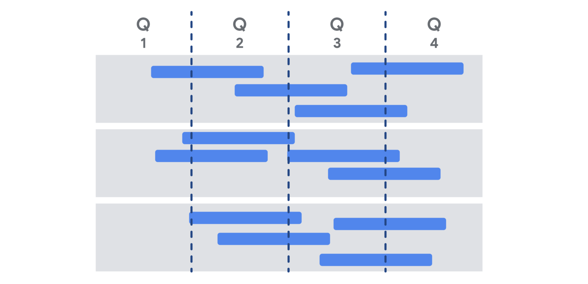

# Applying Agile in the organization

When reading case studies, focus on the problem, the effect it had on the business or organization, and the pros and cons of the solutions reached to help you determine some applicable key takeaways.

As you read, ask yourself: 
* What is the issue?
* What is the goal of the analysis?
* What is the context of the problem?
* What key facts should be considered?
* What alternatives are available to the decision-maker?
* What would you recommend, and why?

## Value Roadmap - Benefits, pitfalls, and best practices
Each team or company may interpret the roadmap slightly differently. Here are some of the various types:
* Project roadmap
* Product roadmap
* Value roadmap
* Lean roadmap
* Agile roadmap

Roadmaps are often represented visually and many try to fit the roadmap on one page so that reviewers can notice the big picture of the product timeline.

__Benefits of developing and maintaining a product roadmap are numerous:__
* Clarifying the sequence of deliverables 
* Showing teams how their efforts relate to the north-star vision. In other words, their ultimate goal. 
* Showing stakeholders the incremental value that will be achieved over the course of the project (rather than reviewing it as one big delivery at the end)
* Helping stakeholders roughly understand the layout of the work behind the deliverable

__Pitfalls to avoid:__
* Letting stakeholders think the roadmap is set and unchangeable. This may cause stakeholders to impede teams’ ability to adapt in response to new information, as well as put a lot of pressure on teams to achieve deadlines no matter what it takes.
* Spending too much time fine-tuning delivery dates versus keeping them rough and improving specificity as the dates get closer
* Putting all the work into creating the roadmap rather than producing the deliverables 

__Best practices__
* Make it highly noticeable to the team and refer to it frequently.
* Clearly indicate the highest priority items.
* If possible, clearly indicate the highest value items.
* Make it visible to your wider stakeholder group so that they can use it for their planning. 
* Conduct regular reviews of the roadmap with sponsors, stakeholders, and the team to ensure that it is still providing the blueprint for the project.

## Responding to change over following a plan
The best way to think about changing your plan is to break it down into three stages:
* Identifying a needed change 
* Deciding to make the change
* Implementing the change

### Step 1: Identifying a needed change 
Here are some aspects of your project that may be candidates for change: scope, time, and costs (or resources). As we previously learned, these are called the “triple constraint,” and they provide a great framework for evaluating change in Agile and traditional projects.

* In Agile, __scope__ refers to the contents of the product roadmap, the items in the Product Backlog, the intended deliverables of the project, and the intended users or customers. This is the “what” of the project.
* __Time__ refers to the elements of time or layout of the deliverables over a period of time. This could include the product roadmap timeline, release schedule, or even the Sprint duration. This is the “when” of the project.
* __Costs or resources__ refer to the makeup of the Development Team, project managers, and product owners, and other “business people” as well as the equipment available to create the deliverable. This is the “how” of the project.

Agile projects are open to change in any of these three areas, and a needed change could be identified by any project stakeholders, including the Product Owner, Project Manager, Scrum Master, or the Development Team themselves. Sources of identified changes could include:
* Customer feedback on early prototypes results in new features and some deleted features (scope change)
* Sprint Retrospective identifies an area of understaffing (cost or resource change)
* Critical project dependencies or deliverable dates have shifted, resulting in a change to the project roadmap (schedule or time change)

### Step 2: Deciding to make the change
Next, how do you decide to actually make the change? There are many decision-making models available to reference. Here are the basic steps involved in most of these models:
* __Identify the “decider.”__ It is best to have a single person—generally the Product Owner or a senior stakeholder—in the role of decider to ensure consistency and accountability. 
* __Develop and share what factors are important to the decision__, and gather supporting data that will help the decider make the decision.
* __Openly discuss the benefits and costs of the decision.__ Identify areas of uncertainty and capture assumptions.
* __Document the decision.__

### Step 3: Implementing the change
Once changes are approved, it is important to do several things:
* __Document the change and decision-making process.__ Include meeting notes, pros/cons lists, assumptions, and data that went into making the decision to change the project.
* __Capture the change in any affected artifacts.__ Update any roadmaps, Product Backlogs, staffing plans, and integration dates, and include a reference to the source of the change so that stakeholders can refer back to it. Consider using revision labels or dates on affected documents like “version 1.2” or “updated on December 20th” so that the team can clearly recognize that the document has changed.
* __Share the change with all affected stakeholders.__  You can do this through many types of forums: in person at meetings, in documentation and meeting notes, and through email announcements. 
* __Monitor the change for a certain amount of time.__  This ensures that the team is supportive and aware of the change.

*If the change was not approved during the decision stage, you should still document the information and logic used to make the decision. You may even consider putting a change on hold while you wait for more information to make the decision with higher confidence.*

## The influencer change framework
The influencer change framework developed by Joseph Grenny, Kerry Patterson, David Maxfield, Ron McMillan, and Al Switzler in the book INFLUENCER: The New Science of Leading Change, which explores the power of influence in facilitating organizational change.

__What does it mean to be an influencer?__

These days, when we hear the word influencer, some might think of social media stardom. But being an influencer is bigger than getting “likes”—it is about someone’s ability to lead and influence others to change their behaviors, hearts, and minds to produce meaningful, sustainable results. As a project manager, you will be asked to lead efforts that require this level of change, and applying this model can lead to a big impact.

To influence is different than to persuade. Persuasion is short-term, while influence is lasting. In order to have real influence, you need others to trust you, consider you an authority, and have confidence in your decisions. As a project manager in Agile projects, you may use influence to facilitate organizational change or to get a team to try a new tool, process, or technology. When facilitating organizational change, influence is the difference between temporary changes in behavior and deep change in culture and values.

## Three keys to influence

### 1. Clarify measurable results
You can’t influence others to change until you know what you want, why you want it, and when you want it. You may recall that effective results are specific, measurable, achievable, relevant, and time-bound (S.M.A.R.T). When setting goals for a project, remember to ask yourself what the "why" entails. Are the results specific and measurable? Is it what you intended? Is it time-bound? Also, make sure the measures are visible and transparent to the entire team throughout the change.

### 2. Find vital behaviors 
A vital behavior is the action an individual takes at a pivotal moment in the context of the change they are seeking. For example, if a member of the Development Team is seeking to increase involvement of the Product Owner throughout the development process, they might exhibit a vital behavior when they have just finished mocking up a new feature. Instead of just continuing on to the next item on their to-do list, they might send an email to the Product Owner to review their work and provide feedback. By choosing to include or exclude their Product Owner at a pivotal moment, the developer is taking a small action to enact the change they want to create.

As we have discussed, real change happens when you can change the behaviors of others. Whether you are changing the minds of your team, stakeholders, or customers, it is important to track their current behavior patterns and understand the behaviors you need them to adopt in order to make the change you are seeking. 

To determine vital behaviors, you might consult experts, scan the best and most-cited articles and research, or perform a culture assessment by identifying norms and customs within the team. When identifying the behaviors, evaluate which behaviors are constructive to the change you wish to promote and notice examples of those who succeed where most others fail.

### 3. Use the six sources of influence
The authors of INFLUENCER: The New Science of Leading Change studied companies and individuals who were successful or unsuccessful with implementing change, and they identified six sources or factors that were correlated with successful change. When determining how to influence your target audience to create change, you should consider using all of these sources to increase your chances of success. You may even consider prioritizing these based on your knowledge of your audience. For example, some target audiences may be most swayed by financial incentives, while others may be more incentivized by social justice impacts.  

Here are the six sources uncovered by the authors in their research, including a sample idea of how you can use these examples in your work in tandem with our Product Owner involvement scenario (described earlier):  

1. __Personal motivation:__ Are the individuals motivated internally to engage in the new behavior? Can you help them “love what they hate”? 
Example: Ensure the Product Owner is timely, appreciative, and effective while giving their feedback. 

2. __Personal ability:__ Are the individuals capable of performing the behavior? Do they have the ability, knowledge, and skills to “do what they can't”?
Example: Ensure that the developer knows how to use the available demo tools and can easily send a quick video of the new feature in their email to the Product Owner. 

3. __Social motivation:__ Are there social contacts or networks encouraging or discouraging this new behavior? 
Example: Have the Development Team members remind each other in the Daily Scrum to email the Product Owner before they finalize the work.

4. __Social ability:__ Does the team have resources within their social network to help them carry out the new behaviors?
Example: Give the Development Team a tool to track all of their demos to the Product Owner during the Sprint. 

5. __Structural motivation:__ Are there rewards or incentives that they will receive if they perform the new behaviors? 
Example: Provide a coffee gift card Sprint award that the Product Owner gets to award after each Sprint.

6. __Structural ability:__ Are there environmental factors at play that either deter or support the new behavior? Can you make the incorrect behavior harder to do than the correct behavior?
Example: Add a rule to the content management system that pre-populates the name of the Product Owner in the reviewer list.

### Key takeaway
These three keys to influence make up the influencer change framework and will improve your chances of success with a change. Clarify measurable results, find vital behaviors, and leverage six sources of influence in tandem to lead an organization, team, or an individual to experience positive change. 

Suggested reading:
[INFLUENCER: The New Science of Leading Change](https://www.prnewswire.com/news-releases/influencer-the-new-science-of-leading-change-207352831.html) or the article [The Influencer Change Framework–The Power to Change Anything](https://sourcesofinsight.com/influencer-the-power-to-change-anything/), which summarizes the book.

## Coaching versus managing in Agile
Management is about giving direction, while coaching is about teaching.

### Managing
So far, we have focused on the responsibilities of project managers. We know that project managers are tasked with delivering a project objective and solving problems as they arise. Project managers keep team members organized and on track. They streamline communication and give directions. This is very indicative of a traditional management approach. At its core, managing requires overseeing the work of others and can include: 
* Onboarding and orienting new employees
* Conducting meetings
* Delegating tasks and assignments
* Monitoring progress and performance against those tasks
* Making high-level decisions

In Agile project management, however, teams are designed to be self-managing. A self-managing team has the autonomy to choose how best to accomplish their work, rather than being directed by others from the top down. Agile team members should also feel empowered and equipped to problem-solve on their own.

Even so, there are some cases where the decisive action of a manager is required. Examples include if there is an emergency that needs immediate action, if you are behind on a deadline, or if a client has very specific needs and you are the most familiar with them. In a results-driven project with little room for error, someone needs to step in and take the lead. That is where a managing approach comes in. 

### Coaching 
Although managing seems inherent to project management, coaching is also an important part of the project management role. 

Coaching is a two-way communication style aimed at influencing and developing team members’ skills, motivation, and judgment. Coaching empowers team members to arrive at solutions on their own by teaching them critical thinking and decision-making skills. This is achieved through offering feedback and providing opportunities for professional development. When challenges arise, coaches will offer guidance, then get out of the way. Coaches don’t jump in during times of crisis in a way that a manager would. Coaches ask questions to help team members arrive at conclusions on their own.  

Coaches trust that their team members can make smart decisions, and trust can go a long way. When team members feel trusted, workplace satisfaction increases, and the quality of work improves. 

It is appropriate to use a coaching approach when a team member already has experience working on similar projects and is working on growing new competencies or is trying a new approach for the first time. Coaching is about building confidence and capabilities so that individuals can continuously grow and improve. There are a few principles to keep in mind when coaching: 

* __Motivate:__ Coaches motivate team members to take action. They point out the value in others’ work and instill within them a sense of pride in what they do. 
* __Support:__ Coaches are an accessible resource for their team to come to when they experience problems or if they have an idea they want their feedback on. 
* __Encourage and appreciate:__ When someone on their team is struggling with a heavy workload, a coach will acknowledge and validate the weight of their efforts and assure them that they are capable of handling the challenges ahead.

Coaching is appropriate in many circumstances, especially when you need to build up the confidence of an individual or a team. The most effective leaders strike a healthy balance between managing and coaching based on the needs of the situation, individual, and project they are leading. Examples of where coaching would be helpful include when a team member is branching out into using a new technology or discipline that will turbocharge their career opportunities, when an individual’s behavior is having unintended consequences on the team dynamics that are not readily visible, or if a team is recovering from a setback.

Here’s a scenario where a project manager or Scrum Master should step in to coach a team: Imagine a Scrum team has failed to launch a product that meets the customer needs Sprint after Sprint. The Product Owner continues to communicate to the team that the features are not quite right, and they need to rework the product in the next Sprint or release. The team feels deflated, and they are showing signs of burnout because they keep working on the same three features. Here is a perfect opportunity to do some coaching with the whole team. Consider bringing them together for a working session and cycle through all three principles of coaching:

* __Motivation:__ Ask the team to brainstorm positive reasons why the customer is providing this feedback and why it matters to create an excellent end product.  
* __Support:__ Work with the team to capture ideas on how to streamline the customer feedback process, such as a design Sprint with the customer in attendance.
* __Encourage and appreciate:__ Set up an event where the team celebrates the work they have accomplished so far, and make the event fun and inclusive for all team members.

When deciding which approach to use, ask yourself:  
* What is the desired outcome? 
* What is the skill level of the team member who has encountered a problem? 
* What does the situation need now to reach the desired outcomes?

## Agile team challenges

__Do more Demos of the solutions with the team__

More Demos help to ensure the team is delivering on the value roadmap. Beyond additional Demos, the project manager can ask the team to focus on only a few user stories per Sprint and use Retrospectives to identify challenges.

__Focus on only a few user stories per Sprint__

If the team is experiencing value delivery issues, one solution is to focus on a few stories per Sprint and finish an item before moving on. The project manager can also do more solution Demos with the team and use Retrospectives to identify challenges.

__Use Retrospectives to ask the team if anything is slowing them down__

Retrospectives can help to identify issues, like if the team is waiting on dependencies or experiencing communication challenges. The project manager can also try doing more solution Demos with the team and ask the team to focus on only a few user stories per Sprint.

