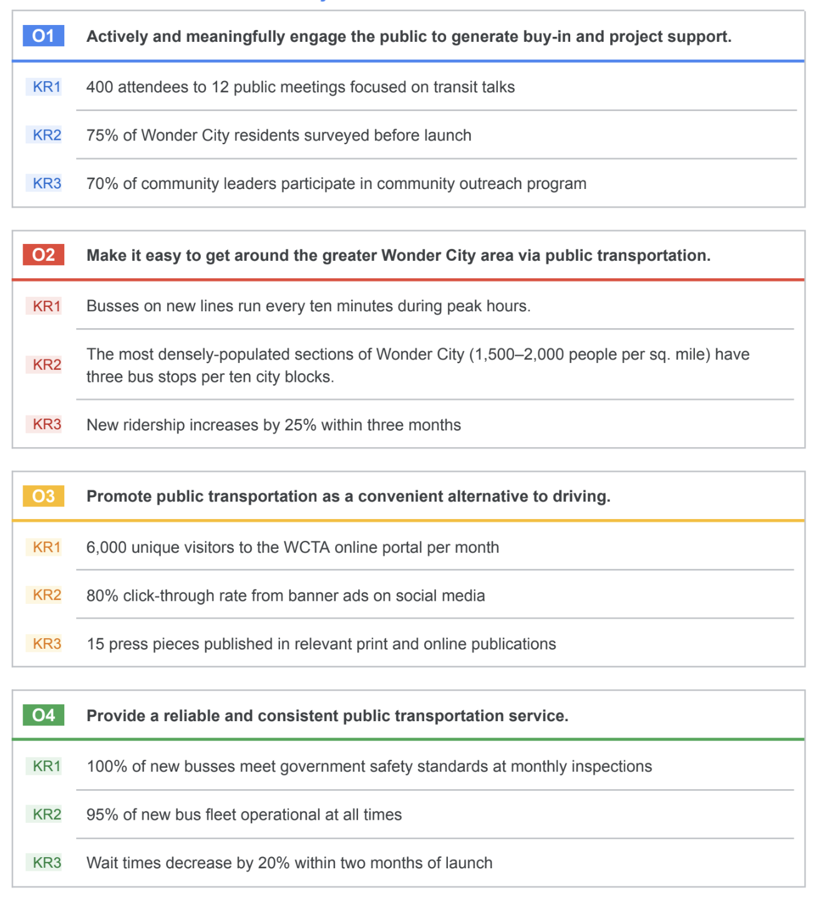
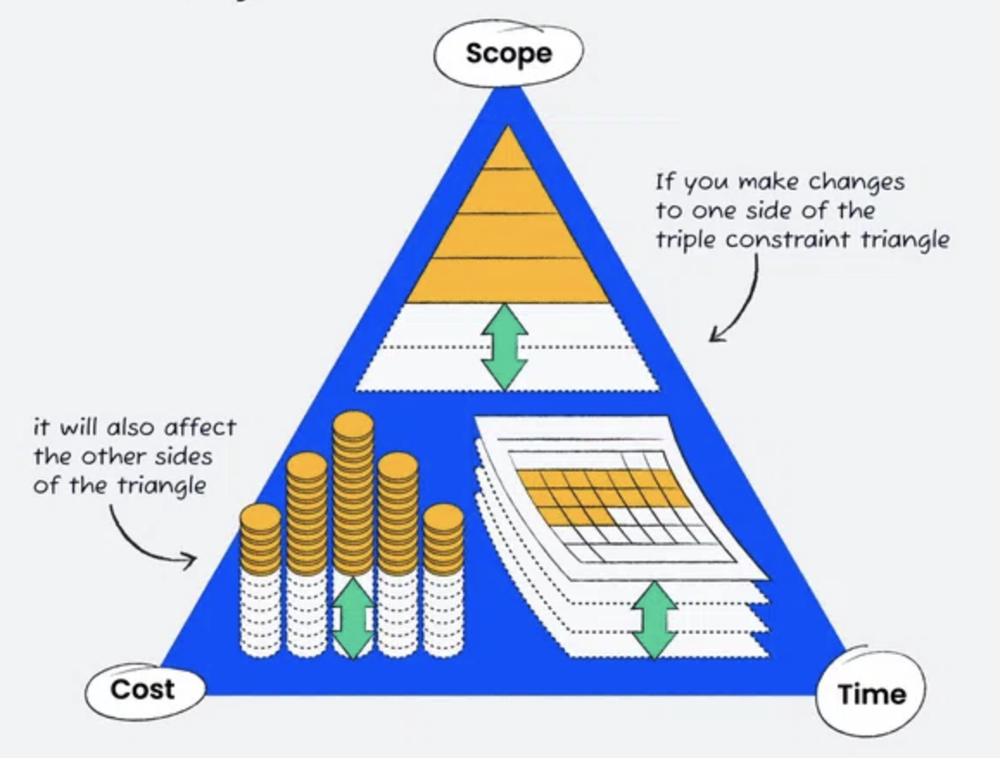
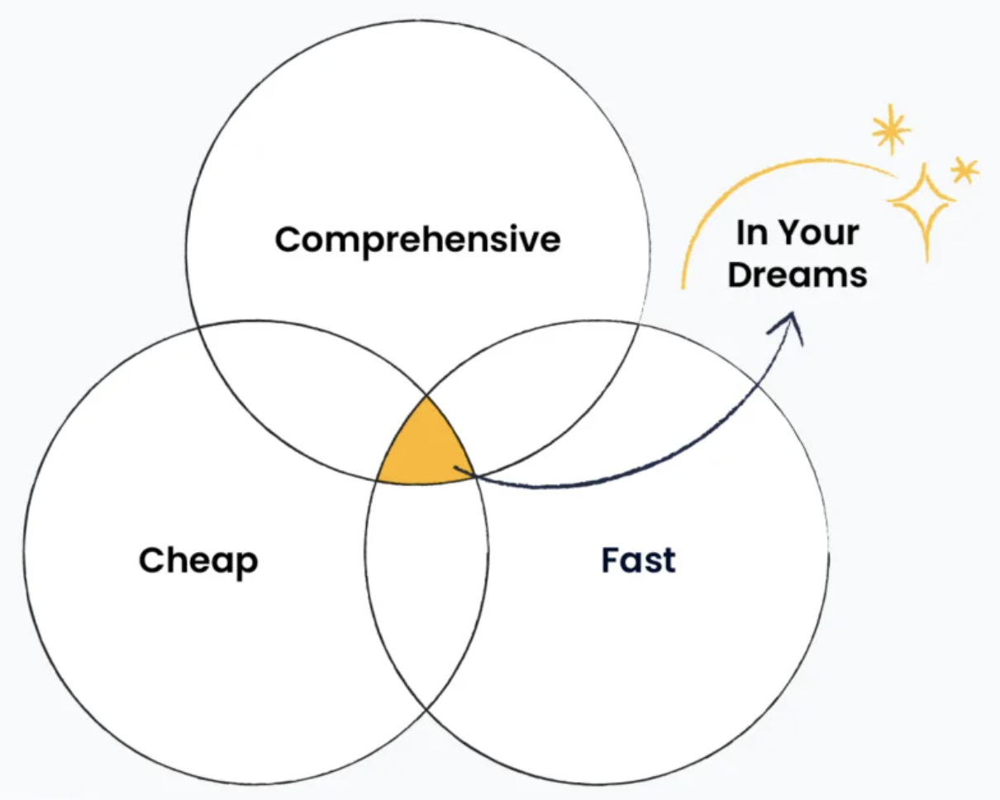

# Defining project goals, scope, and success criteria

## SMART Goals
* __Specific__: The objective has no ambiguity for the project team to misinterpret. 
* __Measurable__: Metrics help the project team determine when the objective is met.
* __Attainable__: The project team agrees the objective is realistic.
* __Relevant__: The goal fits the organization’s strategic plan and supports the project charter.
* __Time-bound__: The project team documents a date to achieve the goal.

SMART goals are well-defined goals that help keep projects on track. They’re specific, measurable, attainable, relevant, and time-bound. SMART goals are measured with figures or numbers known as metrics. Benchmarks are used to help confirm the accuracy of metrics.

* What do I want to accomplish?
* Why is this a goal?
* Does it have a specific reason, purpose, or benefit?
* Who is involved?
* Who is the recipient?
* Employees, customers, the community at large?
* Where should the goal be delivered?
* Finally, to what degree? In other words, what are the requirements and constraints? 

### Scenario

Review the scenario below. Then complete the step-by-step instructions.

Office Green, LLC, is a commercial landscaping company that specializes in plant decor for offices and other businesses. The company is getting ready to introduce its new Plant Pals service, which will provide high-volume customers with small, low-maintenance plants for their desks. You are the project manager assigned to manage the Plant Pals launch.

Office Green´s main goal for this project is: “Increase revenue by 5% by the end of the year by rolling out a new service that provides office plants to high-volume clients.”

You recently met with the project sponsor (the Director of Product) to discuss two additional goals for the Plant Pals project:

* Boost Office Green´s brand awareness
* Raise Office Green´s customer retention rate

In order to help your team achieve these two additional project goals, you need to turn them into SMART goals. The notes from your meeting with the Director of Product are below. You can use this information to create SMART goals:

* Office Green´s customer retention rate was 80% last year, but the CEO wants that number to increase by at least 10% this year.
* Last year, 70% of customers who left Office Green for competitors said they did so because they wanted more extensive services. When surveyed, 85% of existing customers expressed an interest in Plant Pals.
* The Vice President of Customer Success expects Office Green to achieve a customer satisfaction rating of over 90% this yea a slight increase over last year. The rating has stayed between 85%-90% for the last five years.
* The company plans to create an Operations and Training plan for Plant Pals to improve on existing customer service standards and boost efficiency.
* Office Green will promote the new service with a new marketing and sales strategy, a redesigned website with a new Plant Pals landing page, and a print catalog. 
* With the publicity around the launch, Office Green projects that their customer base will grow by at least 15%.
* Website traffic has dipped slightly over the past three years, from 15K to 13K visits each month. The Marketing Manager wants unique page visits to increase by at least 2K each month by the end of the year, which is in line with the results of prior marketing campaigns.
* The project is scheduled to launch by the end of the third quarter. The project team will continue to collect data on the project´s progress through the rest of the year and assess how well it has met its goals at the end of the fourth quarter. (It is currently the start of Q1.)

### Step-By-Step Instructions

__Step 1:__ Access the template

Link to template: Activity template: SMART project goals

__Step 2:__ Revise the goals to be SMART

The template contains the two additional project goals for Plant Pals, neither of which meets all the SMART criteria:

* Office Green will boost brand awareness
* Office Green will raise their customer retention rate

Turn these two goals into SMART goals using the information from the scenario above. Write the revised goals next to SMART Goal One and SMART Goal Two. Your goals should be complete, but brief, one or two sentences is enough.

For example, here is a goal that´s missing some of the SMART criteria:

* Office Green will soon create an app to help customers care for their plants.

That´s not a bad start, but it isn´t specific, measurable, or time-bound. Here´s the same goal, rewritten as a SMART goal:

* Office Green will create an app that offers tips and reminders to help customers care for their plants. The app will be completed within 18 months and be compatible with 100% of the types of plants Office Green sells.

__Step 3:__ Explain what makes each goal SMART

Now that you´ve rewritten the goals, explain what makes them SMART by answering the following questions:
* What makes the goal specific? Does it provide enough detail to avoid ambiguity?
* What makes the goal measurable? Does it include metrics to gauge success?
* What makes the goal attainable? Is it realistic given available time and resources?
* What makes the goal relevant? Does it support project or business objectives?
* What makes the goal time-bound? Does it include a timeline or deadline?

Be specific in your answers. For instance, the plant care app SMART goal is:
* ___Specific:___ The team knows what they´re building: an app that helps users care for their plants and reminds them to do so. 
* ___Measurable:___ The app will be complete when it includes 100% of the plant types Office Green sells.
* ___Attainable:___ The company has the knowledge, time, resources to build the app. 
* ___Relevant:___ Office Green´s business model relies on customers caring for their plants successfully. 
* ___Time-bound:___ The goal includes an 18-month timeframe.

If you find that either goal does not meet all the SMART criteria, try revising it and answering the questions again.

### Created SMART Goals
__Original goal one:__ “Office Green will boost brand awareness.”

__SMART Goal one:__ “Office Green will boost brand awareness with a new marketing
and sales strategy and website update that will increase page views by 2K per
month by the end of the year.”

What makes this goal specific? Does it provide enough detail to avoid
ambiguity?
* The goal is specific because it’s clear what Office Green needs to do to achieve it
(update the website and create a marketing and sales strategy to boost customer awareness
of the brand).

What makes this goal measurable? Does it include metrics to gauge success?
* The goal is measurable because it sets a metric of a 2K monthly increase in
monthly page views.

What makes this goal attainable? Is it realistic given available time and
resources?
* The goal is attainable because the team has a full year to plan and execute the
strategy. Two thousand additional page views per month is an increase of about 15%, which is
in line with the results of previous marketing campaigns.

What makes this goal relevant? Does it support project or business objectives?
* The goal is relevant because increased brand awareness can bring in new
customers. New customers should mean more sales, so this goal supports the project
objective of increasing revenue by 5% by the end of the year.

What makes this goal time-bound? Does it include a timeline or deadline?
* The goal is time-bound because it sets a deadline of the end of the year.

__Original goal two:__ “Office Green will raise their customer retention rate.”

__SMART goal two:__ “Office Green will raise their overall customer retention rate by
10% by the end of the year by implementing a new Operations & Training plan for
the Plant Pals service.”

What makes this goal specific? Does it provide enough detail to avoid
ambiguity?
* The goal is specific because it’s clear what Office Green needs to do to achieve it
(Implement an Operations & Training plan that will improve on existing customer service
standards and boost efficiency).

What makes this goal measurable? Does it include metrics to gauge success?
* The goal is measurable because it sets a metric of a 10% increase in customer
retention rates.

What makes this goal attainable? Is it realistic given available time and
resources?
* The goal is attainable because customer retention is already high and a large
percentage of existing customers have expressed interest in the service. Many former
customers have also stated that they left for landscapers that offered additional services, like
Plant Pals.

What makes this goal relevant? Does it support project or business objectives?
* The goal is relevant because raising customer retention should lead to increased
sales, which supports the project objective of increasing revenue by 5% by the end of the
year.

What makes this goal time-bound? Does it include a timeline or deadline?
* The goal is time-bound because it sets a deadline of the end of the year.

## OKR
__OKR__ combine a goal and a metric to determine a measurable outcome.

__OKR__ is an acronym for objectives and key results. Objectives define what needs to be achieved and describe a desired outcome. Key results define how the project team knows whether or not they have met their objective.

* [OKR Examples](https://business.adobe.com/blog/basics/okr-examples)
* [How OKRs and KIPs work together](https://www.reflektive.com/blog/okrs-and-kpis-what-they-are-and-how-they-work-together/)
* [Google OKR Playbook](https://www.whatmatters.com/resources/google-okr-playbook)

Objectives meet the following criteria:
* Aspirational
* Aligned with organizational goals
* Action-oriented
* Concrete
* Significant

## Scope

### Asking scope-defining questions
Make sure you understand the who, what, when, where, why, and how as it applies to the scope.

__Stakeholders__
* How did you arrive at the decision to ___? 
* Did the request originate from the owner, customers, or other stakeholders? 
* Who will approve the scope for the project? 

__Goals__
* What is the reason for ___? 
* What isn't working in the ___? 
* What is the end goal of this project? 

__Deliverables__
* What exactly needs to be updated? 
* Does the ___ need a remodel? 

__Resources__
* What materials, equipment, and people will be needed? 
* Will we need to hire contractors? 
* Will we need to attain permits? 

__Budget__
* What is the budget for this project? Is it fixed or flexible? 

__Schedule__
* How much time do we have to complete the project? 
* When does the project need to be completed? 
* 
__Flexibility__
* How much flexibility is there? 
* What is the highest priority: hitting the deadline, sticking to the budget, or making sure the result meets all the quality targets?

### Scope Creep
*__Scope creep__ is when a project’s work starts to grow beyond what was originally agreed upon during the initiation phase.*

### Scope management best practices
* __Define your project’s requirements.__ Communicate with your stakeholders or customers to find out exactly what they want from the project and document those requirements during the initiation phase. 
* __Set a clear project schedule.__ Time and task management are essential for sticking to your project’s scope. Your schedule should outline all of your project’s requirements and the tasks that are necessary to achieve them.
* __Determine what is out of scope.__ Make sure your stakeholders, customers, and project team understand when proposed changes are out of scope. Come to a clear agreement about the potential impacts to the project and document your agreement. 
* __Provide alternatives.__ Suggest alternative solutions to your customer or stakeholder. You can also help them consider how their proposed changes might create additional risks. Perform a cost-benefit analysis, if necessary.
* __Set up a change control process.__ During the course of your project, some changes are inevitable. Determine the process for how each change will be defined, reviewed, and approved (or rejected) before you add it to your project plan. Make sure your project team is aware of this process.
* __Learn how to say no.__ Sometimes you will have to say no to proposed changes. Saying no to a key stakeholder or customer can be uncomfortable, but it can be necessary to protect your project’s scope and its overall quality. If you are asked to take on additional tasks, explain how they will interfere with the budget, timeline, and/or resources defined in your initial project requirements. 
* __Collect costs for out-of-scope work.__ If out-of-scope work is required, be sure to document all costs incurred. That includes costs for work indirectly impacted by the increased scope. Be sure to indicate what the charges are for. 

### The Tripple constraint Model
Ref.: [thedigitalprojectmanager.com](https://thedigitalprojectmanager.com/projects/scope-management/triple-constraint/)

__The Iron Triangle__

## Success Criterias
__Product quality__
To measure the success of a product, consider including these metrics on your checklist: 
* Track if you implemented the product’s priority requirements
* Track and assess the product’s number of technical issues or defects
* Measure the percentage of features you delivered or released at the end of the project

__What is important to the customers or stakeholders__
Strategic goals tie back to the business case and the reason you initiated the project in the first place. Often, you can measure the fulfillment of strategic goals via user or customer metrics. Metrics to consider include:
* Evaluating user engagement with the product 
* Measuring stakeholder and customer satisfaction via surveys
* Tracking user adoption of the product by using sales data

__Document, align, and communicate success__
* Who ultimately says whether or not the project is successful?
* What criteria will be measured to determine success?
* What is the success of this project based on?

*It is best practice to get the key stakeholders or the steering committee to review and approve your success criteria. This becomes a mutual agreement on how all parties define the success of the project.*

