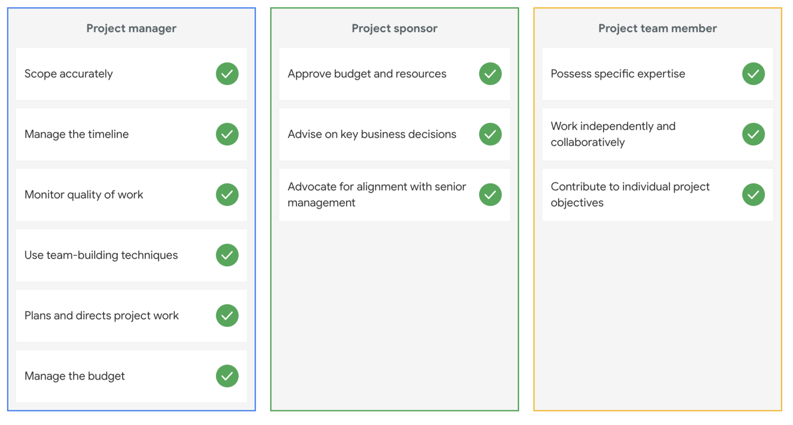

# Working with stakeholders

## Roles and responsibilities

* The right skills and abilities to fill the role
* Who is available?
* What motivates them?

__Pre-assignment__, the sponsor assigns team members to your project.

*Many people avoid discussing their differences, but if you encourage those conversations, you will find a richer understanding and greater creativity that comes from people working together across identity differences. To do this effectively, it is important to dedicate time early on in the team building process to develop trust between team members.*

Team size, skills, availability, and motivation are the building blocks to creating your very own dream team. Always keep in mind that a project manager does not just select dream teams, they create dream teams through collaboration under great leadership.

## Roles
__Stakeholders__
* Primary - directly affected by the outcome of the project.
* Secondary - indirectly affected by the outcome of the project.

__Sponsors__, another primary stakeholder, VIP, critical to communicate with, CEO could also be the project sponsor.

__Team mambers__, considered primary stakeholders.

__User__, considered primary stakeholders.

__Project Manager__, considered primary stakeholders.

## Evaluating stakeholders
