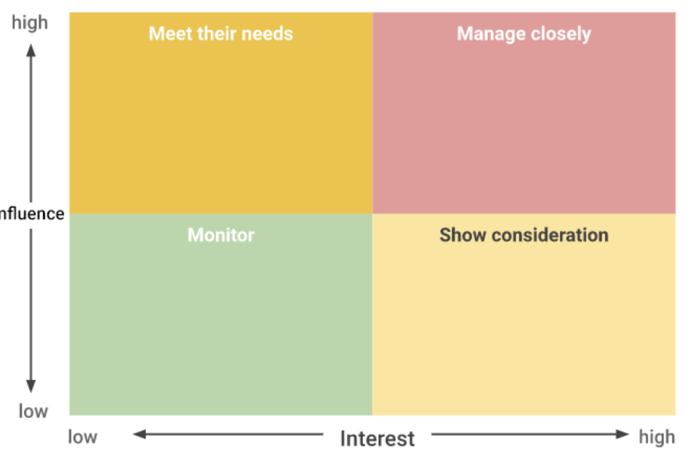
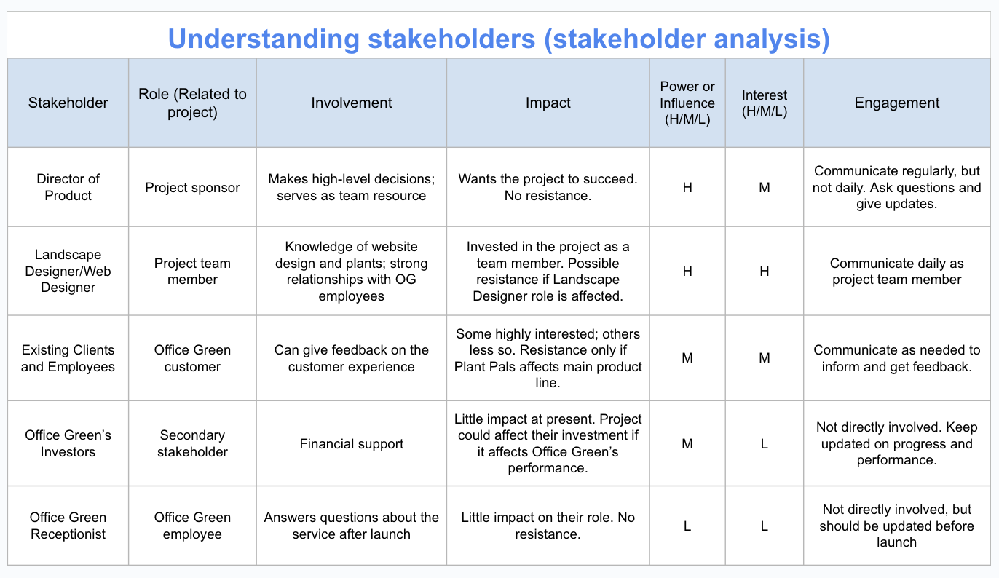
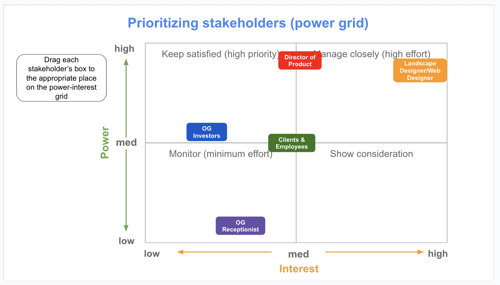
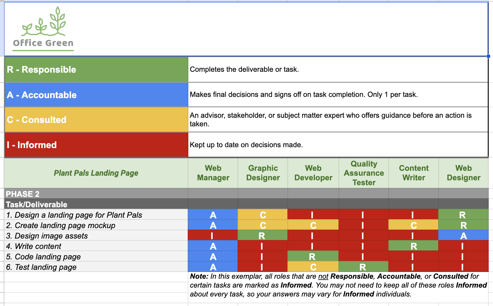
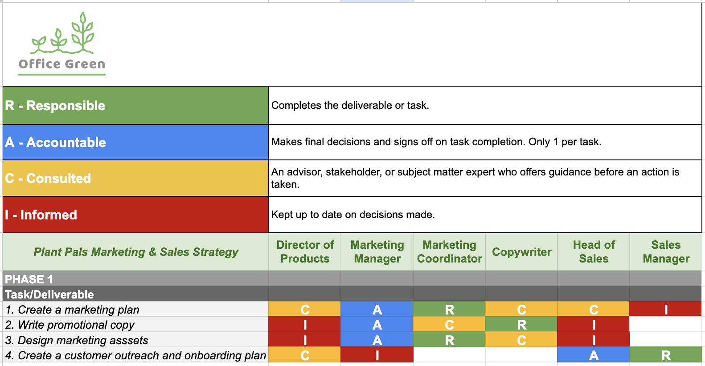

# Working with stakeholders

## Roles and responsibilities

* The right skills and abilities to fill the role
* Who is available?
* What motivates them?

__Pre-assignment__, the sponsor assigns team members to your project.

*Many people avoid discussing their differences, but if you encourage those conversations, you will find a richer understanding and greater creativity that comes from people working together across identity differences. To do this effectively, it is important to dedicate time early on in the team building process to develop trust between team members.*

Team size, skills, availability, and motivation are the building blocks to creating your very own dream team. Always keep in mind that a project manager does not just select dream teams, they create dream teams through collaboration under great leadership.

## Roles
__Stakeholders__
* Primary - directly affected by the outcome of the project.
* Secondary - indirectly affected by the outcome of the project.

__Sponsors__, another primary stakeholder, VIP, critical to communicate with, CEO could also be the project sponsor.

__Team mambers__, considered primary stakeholders.

__User__, considered primary stakeholders.

__Project Manager__, considered primary stakeholders.

## Evaluating stakeholders
Questions for stakeholders:
* What are your most important priorities/goals?
* How will this initiative/project support you and your most important priorities?
* What role would you like to play within this initiative/project?
* Here’s how I plan to keep people informed; does that work for you?
* What can I clarify for you?
* What are your expectations? What would you like for the project to accomplish?
* What would success look like for you?
* Who else do you recommend I reach out to about this initiative?
* What information or insights do you have that might be challenging for me to find?
* Where do you see me getting support for this initiative? Facing resistance?

### Stakeholder Analysis
Ref.: [Stakeholder-analysis-and-power-grid](Stakeholder-analysis-and-power-grid.pptx)

Make a list of all the stakeholders the project impacts.
* Who is invested in the project?
* Who is impacted by this project?
* Who contributes to this project? 

Determine the level of interest and influence for each stakeholder—this step helps you determine who your key stakeholders are. Factors that will play a role in determining a stakeholder’s ability to participate in a project, like physical distance from the project and their existing workload. Various types of stakeholders—some will be active stakeholders with more opinions and touchpoints and others will be passive stakeholders

You might want to form a steering committee during some projects. A steering committee is a collection of key stakeholders who have a high level of power and interest in a project. A steering committee can influence multiple departments within the organization, which means that they have the potential to release a greater number of resources to the project manager.  

#### Example

### Prioritizing stakeholders and generating their buy-in
* Clearly mapping the work of the project to the goals of the stakeholder.
* Describing how the project aligns with the goals of the stakeholder's department or team.
* Listening to feedback from the stakeholder and finding ways to incorporate their feedback into the project's charter where appropriate.

## RACI Chart
Ref.: [Template_-RACI-chart---Phase-1](Template_-RACI-chart---Phase-1.xlsx)

*Often referred to as a Responsibility Assignment Matrix (RAM), RACI diagram, or RACI matrix.*

Use it to get an overview over workload balance and avoid silos, where the knowledge and responsibility for a task falls on one person.

You can document your team and stakeholders’ acknowledgment of these expectations through the project charter, meeting notes, and in the RACI chart itself. 

A RACI chart creates clear roles and gives direction to each team member and stakeholder.

* R: Responsible: who gets the work done
* A: Accountable: who makes sure the work is done
* C: Consulted: who gives input or feedback on work
* I: Informed: who needs to know the outcome

*Where possible, it is helpful to separate these roles.*

### Types
__1. Responsible__

The ones who are actually doing the work.
 
* What department does the work fall under?
* Who will perform the work?

__2. Accountable__
Making sure the task gets done. It is important to have only one individual accountable for each task.

* Who will delegate the task to be completed?
* Who will review the work to determine if the task is complete?

__3. Consulted__
Have useful information to help complete the task. There is no maximum or minimum number of people who can be assigned a “consulted” role.

* Who will the task impact?
* Who will have input or feedback for the responsible person to help the work be completed?
* Who are the subject matter experts (SMEs) for the task?

__4. Informed__
Need to know the final decisions that were made and when a task is completed.

* Who cares about this task’s completion?
* Who will be affected by the outcome?

### Put your RACI into practice
Share your RACI chart with your sponsors and stakeholders to get buy-in and sign-off. When you get stakeholder buy-in, you will be able to set clear expectations for your team and ensure that everyone is aligned on their responsibilities.

### Stakeholder management during project initiation
* __Identify all the stakeholders at the beginning of your project or initiative.__ Get everyone involved as early as possible to set clear expectations, responsibilities, and boundaries. Identifying your stakeholders early on gives them ample time to voice any concerns they may have about the project or their role within it. If they feel a sense of ownership from the beginning, your stakeholders may be more likely to embrace their roles, give appropriate input, and help remove barriers to allow the project to move forward.  

* __Keep the project vision clear.__ The project vision describes the need the project is fulfilling. It is important to have a clear, specific project vision because, as we have learned, stakeholders may apply pressure to increase the requirements, shorten the timeline, or cut resources. Ensuring that stakeholders have agreed upon the vision—and, more specifically, what "done" looks like—provides clarity for everyone involved with the project. Including highly-influential stakeholders in the strategic planning processes will make sure that all team members are aligned with project vision. 

* __Equip your stakeholders with user-friendly resources at all times.__ This could mean creating a one-pager (a one-page document that provides an overview of your project) or weekly status report with the latest information and links to the main project artifacts. It may also mean ensuring everyone has access to necessary documentation.

### Stakeholder management throughout the project life cycle
You will have to maintain good relationships with all of your stakeholders to ensure they are satisfied and contributing to the team. The following strategies can help you get to know your stakeholders’ interests, concerns, and communication preferences and enlist their help throughout your project’s life cycle:

* __Find out what stakeholders care about and why.__ Ask your stakeholders: What are your most important priorities and goals? What role would you like to play in this project? How will this project support you and your most important priorities?

* __Adjust your communication frequency and approach based on stakeholder roles and preferences.__ Tell your stakeholders: Here’s how I plan to keep you informed—does that work for you?

* __Enlist the help of senior stakeholders when necessary.__ Ask your stakeholders: Who else do you recommend I reach out to regarding this project? 

* __Once stakeholders have a vested interest, bring project problems to them.__ Ask your stakeholders: How would you handle this situation? What solutions come to mind?

## Why projects fail
Some common problems:
* Unrealistic expectations (don't commit to firm dates when initiating the project) 
* Miscommunication
* Lack of resources
* Scope creep

