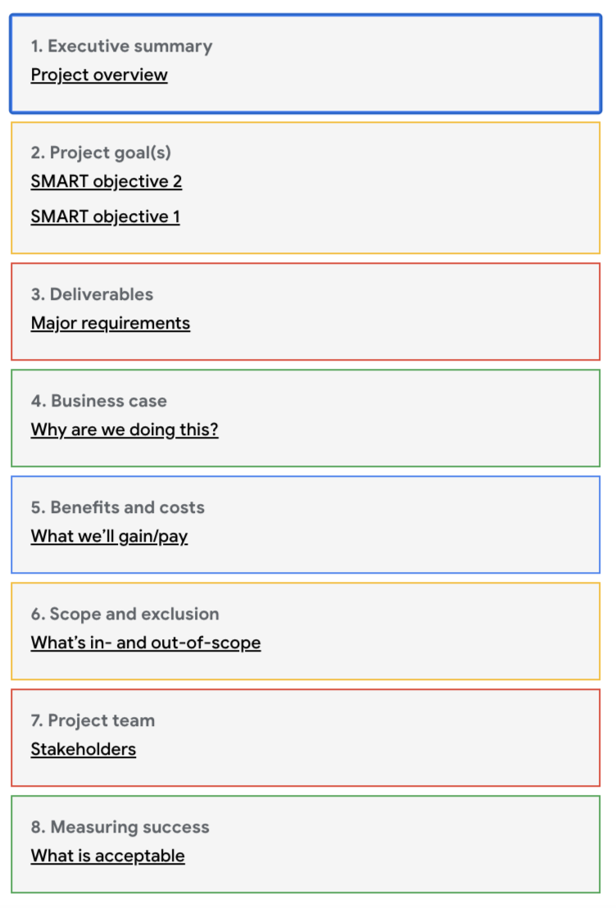

# Resources and tools

## Project Charter
*A formal document that clearly defines the project and outlines the necessary details needed to reach its goals.*

### Guiding Questions to project goals: 
* What do the various team members want to see from the project? Seek keywords in conversations such as goals, desires, outcomes, expectations, hopes, metrics and wants. 
* Which of the goals from your list are most important to the senior stakeholders who sponsored the project? Make note of these goals.
* How will you know the project is done? Consider the ideal end result of the project and work backwards from there. 

### Guiding Questions to project deliverables:
* What physical or digital items will the project produce?
* Where in the conversation do the stakeholders discuss outcomes?
* What are some keywords in the conversation that tell you about project deliverables? Consider words like output, outcomes, delivery, tasks, and responsibility.

### Guiding Questions to charter’s appendix:
* Who are the stakeholders? 
* When do project stakeholders disagree on a particular topic?
* Who is the “decision-maker”?
* How is the misalignment clarified?
* What is the final decision regarding the misalignment?

## Project Management Tools
* Asana
* Basecamp
* Trello
* Jira
* Monday.com
* Microsoft Project or Project Libre
* Smartsheet
