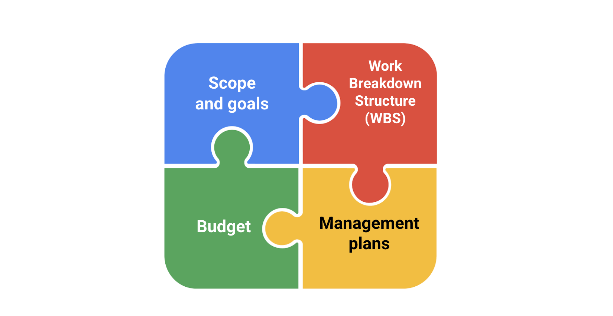

# Project Plan

__Project scope and goals__
Both the project scope and goals will be captured initially in your project charter.

__Work Breakdown Structure (WBS)__
In addition to the WBS, further documentation—such as a RACI chart—will help define roles and responsibilities and would be useful to add to your project plan. Keeping this documentation stored or linked in one place is a best practice for transparency and effective communication.

__Budget__
The project budget is often linked to the project plan because it is heavily dependent on key elements of the project.

__Management plans__
Management plans—such as the change management plan, risk management plan, and communication plan—are all integral to keeping a project organized and on track and should be linked in your project plan.
