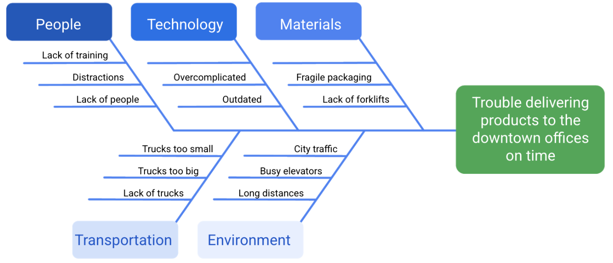

# Risk Management

1. __Identify the risk.__ The first phase of the risk management process is to identify and define potential project risks with your team. After all, you can only manage risks if you know what they are. 
2. __Analyze the risk.__ After identifying the risks, determine their likelihood and potential impact to your project. Serious risks with a high probability of occurring pose the greatest threat.
3. __Evaluate the risk.__ Next, use the results of your risk analysis to determine which risks to prioritize.
4. __Treat the risk.__ During this phase, make a plan for how to treat and manage each risk. You might choose to ignore minor risks, but serious risks need detailed mitigation plans.
5. __Monitor and control the risk.__ Finally, assign team members to monitor, track, and mitigate risks if the need arises.

## Opportunities
Ref.: [Effective strategies for exploiting opportunities](https://www.pmi.org/learning/library/effective-strategies-exploiting-opportunities-7947)

Some examples of opportunities include: 
* Completing a milestone ahead of schedule
* Discounted materials 
* Availability of additional resources (people, investments, equipment)

## Fishbone diagram
*Fishbone diagrams—also known as Ishikawa diagrams or cause-and-effect diagrams*

__Root cause__ is the initial cause of a situation that introduces a problem or risk. The purpose of using fishbone diagrams in risk management is to identify the root cause of a potential problem for a project or program.

