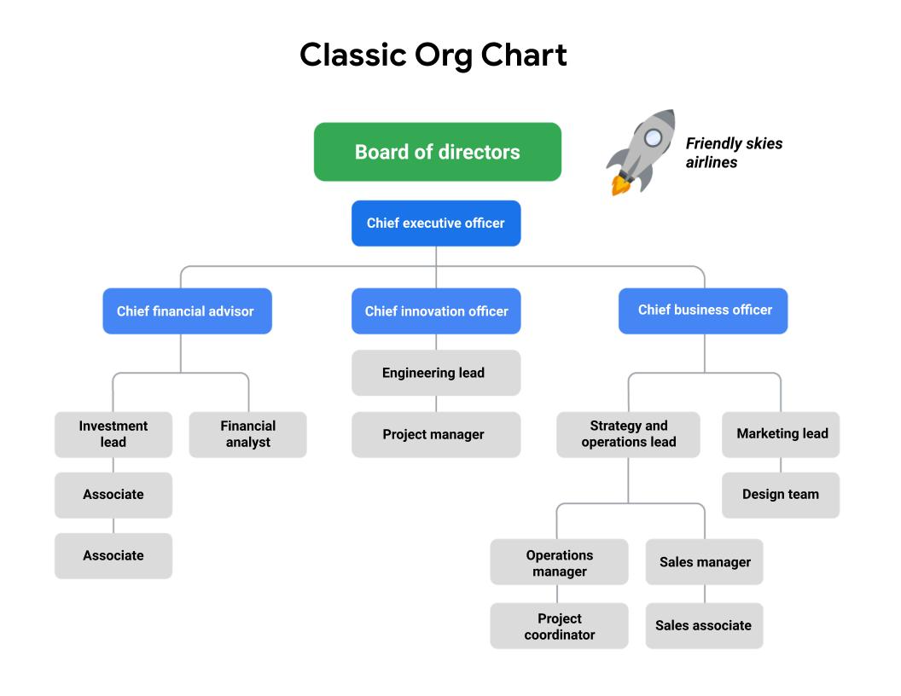
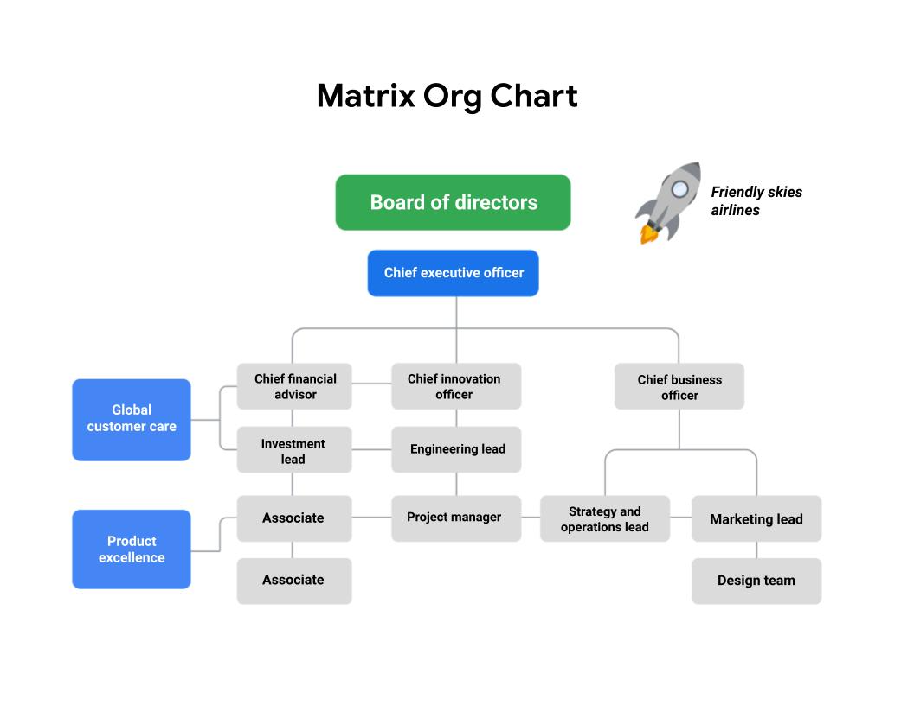

# Week4 - Organizational structure and culture
Project managers must clearly define roles and responsibilities in order to work effectively regardless of sructure.

## Classic and Matrix structure
### Classic
*Your authority may be slightly limited due to competing priorities, approval chains, and other complexities, but setting expectations up front will enable you to navigate the organization and execute your project successfully.*

### Matrix
*The Matrix structure differs from the Classic structure in that the employees have two or more managers. In Matrix structures, you still have people above you, but you also have people in adjacent departments with whom you will need to communicate on your work progress.*

Some project managers or department leads may have the same level of authority as the functional managers and operate more directly.

### Project Management Office (PMO)
PMOs offer guidance and support to their organization’s project managers. They share best practices, project statuses, and direction for all of the organization’s projects while often taking on strategic projects themselves. The main functions of a PMO include:
* Strategic planning and governance
* Best practices
* Common project culture 
* Resource management
* Creation of project documentation, archives, and tools

## Culture
___Identity___: An organization’s culture defines its identity. Its identity essentially describes the way the company conducts  business, both internally and externally. A company’s values and organizational culture go hand-in-hand; its values are part of its identity. You can almost think of an organization’s culture as its personality. That is why it is important to learn your company’s (or target company’s) mission and value statements. The mission and value statements will help you understand why the company exists and will give you insight into what the company believes in and how it will behave. 

___People___: Strong, positive organizational culture helps retain a company’s best employees. People who feel valued, engaged, and challenged are more likely to give their best and want to drive for success. An organization’s culture can help keep talented employees at a company, and it can attract great people too! On the other hand, a toxic culture can have the opposite effect. It is important to find an organization with a culture that fits your personality. One way to find out more about an organization's culture is to talk to the people who work there. You can also take note of the current employees’ attire, expressions, and overall behavior.

___Processes___: Organizational culture can have direct impacts on a company's processes, and ultimately, its productivity. The organization’s culture is instilled throughout the company—from its employees to how its employees do their job. For example, a company that values feedback and employee involvement might have that reflected in their processes by including many opportunities for employees to comment. By allowing employees to feel their voices are heard, this company is adhering to its culture.

### Ask questions
___Atmosphere___
* What is the company’s dress code? 
* How do people typically share credit at this company? 
* Is risk-taking encouraged, and what happens when people fail?
* How do managers support and motivate their team?
* How do people in this role interact with customers and users?
* When and how do team members give feedback to one another?
* What are some workplace traditions?
* What are some of the ways the company celebrates success?

___Policies___
* What are the policies around sick days and vacation?
* Does the company allow for employee flexibility (e.g., working from home, flexible working hours)?
* What policies are in place that support employees sharing their identity in the workplace?

___Processes___
* What is the company’s onboarding process?
* How do employees measure the impact of their work?

___Values___
* What are the company’s mission and value statements?
* How might the person in this role contribute to the organization’s mission?
* How does the organization support professional development and career growth?

### A project manager’s relationship to organizational culture 
* Learning the company’s values
* Clarifying the company’s expectations
* Applying organizational culture to a project

## Change Management
Ask yourself the following questions:
* How will the organization react to change?
* Which influencers can affect change?
* What are the best means of communication? 
* What change management practices will lead to the successful implementation of my project?

### Best practices
___Be proactive___
Proactive and inclusive change management planning can help keep any potentially impacted stakeholders aware of the upcoming changes.

Incorporate change management into your project management steps. For example, you can schedule time during team meetings or create a feedback document to ensure that your team members know there is a place to voice their suggestions and concerns. 

You can also plan steps towards the end of your project to introduce the deliverable to stakeholders in the form of demonstrations, question and answer forums, or marketing videos. You can factor all of these decisions into your plan so that any potential changes are less likely to impact your timeline. If these steps have not been built into your plan, you can escalate and stress the importance of a change management plan to your stakeholders. 

___Communicate about upcoming changes___
Communication should occur regularly among impacted stakeholders, the change management team, and the project team. Check in and communicate throughout the project about how the changes will provide a better experience for end users of the project deliverables. In this way, you support the process by providing everyone with the information they need to feel prepared to adjust to changes once the project is ready to launch. 

Follow a consistent process. Following a clear change management process helps maintain consistency each time there is a change. The change management process should be established and documented early on in your project to guide how the project will handle change. Your organization may also have an overarching change management plan that can be adopted for your project. This may include when the promotion of the change should happen, when training should occur, when the launch or release will occur, and corresponding steps for each phase of the process. 

___Practice empathy___
Changes are inevitable, but we are often resistant to them. By being empathetic to the challenges and anxiety change can bring, you can support the process in subtle ways. 

___Use tools___
Incorporating tools to assist in the adoption of a change can be very helpful. Here are a few examples you can use on your next project:

* [Change Management at the Project Level](https://www.prosci.com/resources/articles/change-management-at-the-project-level)
* [5 Steps to Successful End-User Adoption](https://www.citrix.com/content/dam/citrix/en_us/documents/reference-material/5-steps-to-successful-end-user-adoption.pdf)
* [Change-Management-Framework.pptx](Change-Management-Framework.pptx)
