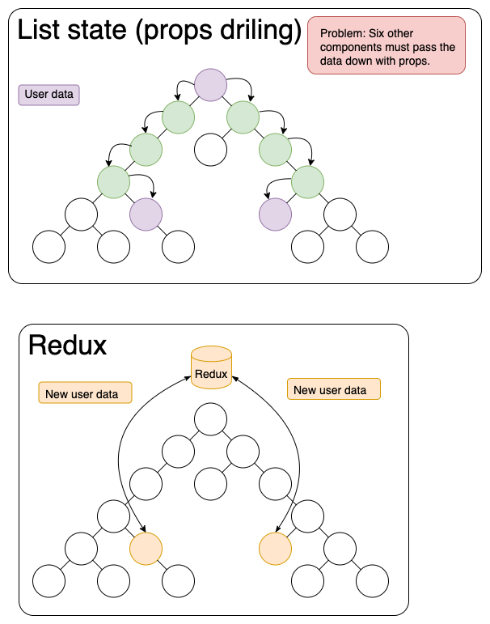

# Redux

___What problem does Redux solve?___

___Reducers___

Redux reducers are without doubt the most important concept in Redux. Reducers produce the state of an application. The second principle of Redux says the only way to change the state is by sending a signal to the store. Reducers are Pure Function, which is a function (a block of code ) that always returns the same result if the same arguments are passed.

___Actions___

Actions are plain JavaScript objects that have a type field. Think of an action as an event that describes something that happened in the application.

___Store___

Redux has one or more immutable stores.

## Plain Redux
<iframe src="https://codesandbox.io/embed/react-redux-demo-xg0sy?fontsize=14&hidenavigation=1&theme=dark"
     style="width:100%; height:500px; border:0; border-radius: 4px; overflow:hidden;"
     title="react-redux-demo"
     allow="accelerometer; ambient-light-sensor; camera; encrypted-media; geolocation; gyroscope; hid; microphone; midi; payment; usb; vr; xr-spatial-tracking"
     sandbox="allow-forms allow-modals allow-popups allow-presentation allow-same-origin allow-scripts"
   ></iframe>
   
## Redux Toolkit
<iframe src="https://codesandbox.io/embed/redux-toolkit-demo-jxrmd?fontsize=14&hidenavigation=1&theme=dark"
     style="width:100%; height:500px; border:0; border-radius: 4px; overflow:hidden;"
     title="redux-toolkit-demo"
     allow="accelerometer; ambient-light-sensor; camera; encrypted-media; geolocation; gyroscope; hid; microphone; midi; payment; usb; vr; xr-spatial-tracking"
     sandbox="allow-forms allow-modals allow-popups allow-presentation allow-same-origin allow-scripts"
   ></iframe>
