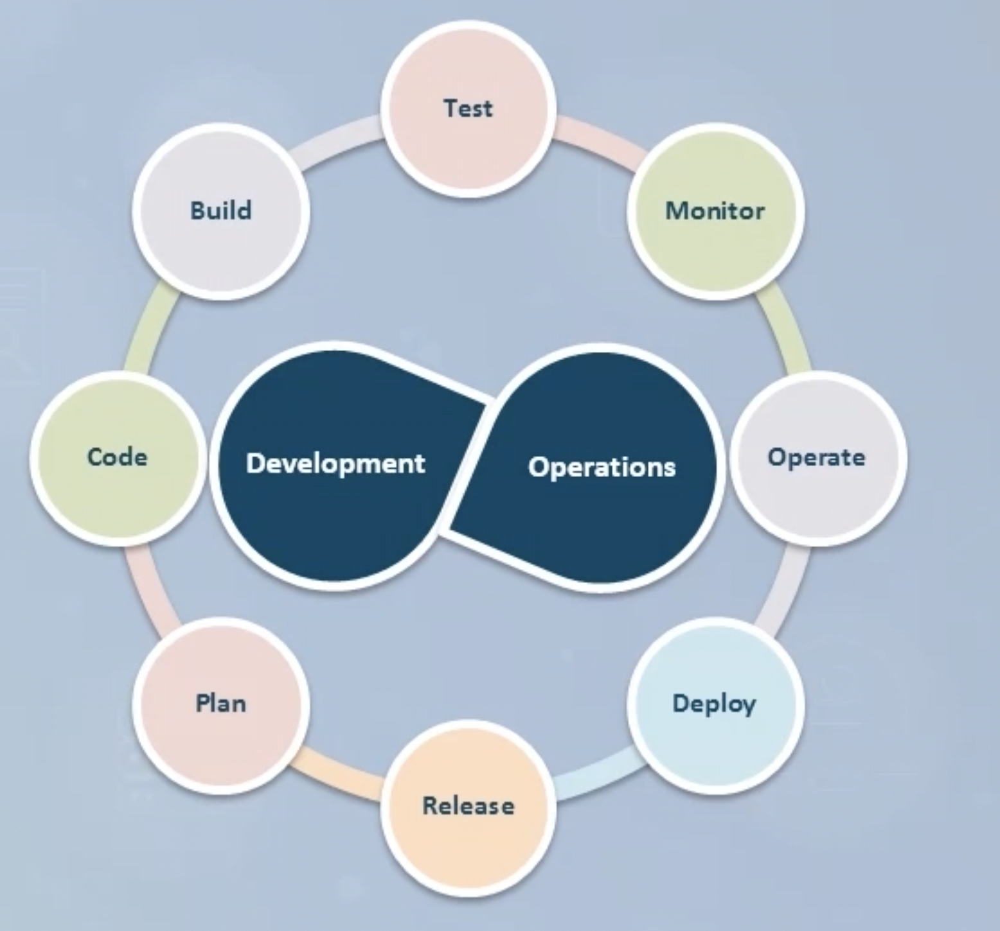
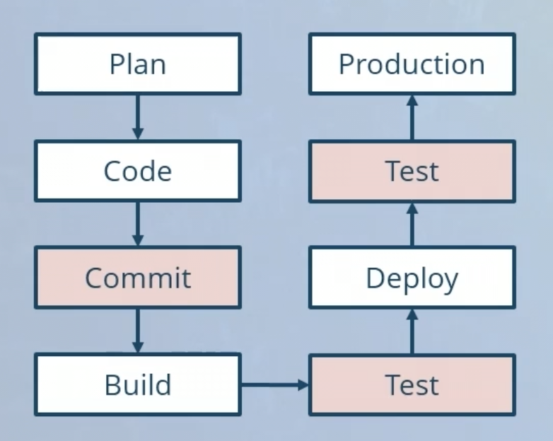

# DevSecOps
DevSecOps is about introducing security in every aspect of the lifecycle of application development in order to minimize vulnerabilities and bring security closer to IT and business objectives. The premise of DevSecOps is that all the stakeholders and participating resources in the software development lifecycle are responsible for security.

* Integrates security within the DevOps process
* Security-as-code culture
* Incorporates security into every development step

## Secure DevOps Lifecycle

## Securing DevOps Pipeline

