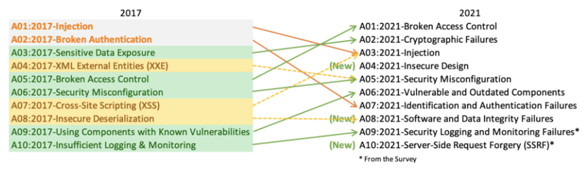

# Secure Web Applications

## Secure Code
* Use-supplied data
  * Input Validation
  * Sanitization
  * Hidden fields
* UI security controls
  * Easily bypassed
  * Maliciout URLS can be constructed

## Secure Coding Considerations
* Generate unique session identifiers
* Keep sessions identifiers hidded
* Forbid concurrent user acount logins with same account
* Configure the "secure" cookie attribute
* Principle of least privilege for specific app pages
* Audit app access
* Use existing trusted code where possible
* After code testing, remove code comments that could be accessible to users
* Apply updates
 * Newly modified code
 * Web app components in use

## Web Application Security Flaws
* Underlying architechture
 * Hardware, network, PKI and authentication
* Poor coding practices
 Lack of propper input validation
* No encryption of
 * Data in transit
 * Date at rest

### Network
* Network accessibility
* Lack of encryption
* Lack of digital signature
* Web app backends on user network

### Operation System
* Missing patches
* Defatult settings
* Unnecessary sevices
* Unused user accounts

### Web server stack
* Missing software updates
* Expire PKI certificates
* Unnecessary running modules
* Default settings
* HTTP vs HTTPS
* Using SSL insted of TLS

### Third-party components
* Lack of components knowledge
* Missing software updates
* Default settings
* Authentication with other components

# OWASP (Open Web App Security Project) Top 10
* Regulary take a look at the top 10 security risks [https://owasp.org/Top10](https://owasp.org/Top10)

